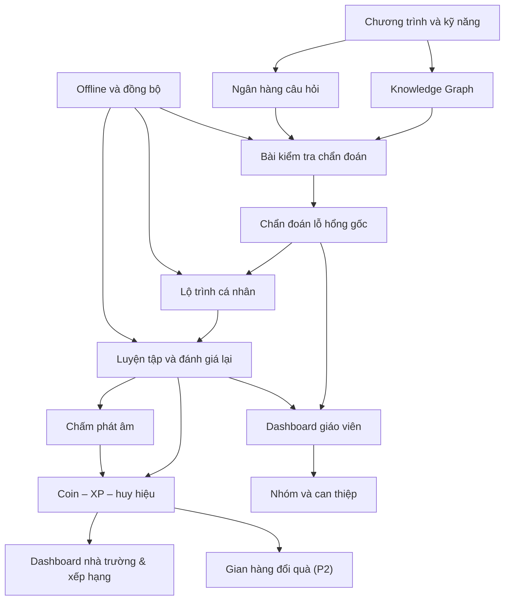

# V-Nexus Tutor — Kế hoạch triển khai nghiệp vụ

## 1. Implementation Objectives

Mục tiêu của kế hoạch là triển khai một MVP có thể chứng minh trọn vẹn vòng lặp:
**chẩn đoán → truy nguyên nhân → tạo lộ trình → luyện tập → đánh giá lại → hỗ trợ giáo
viên**.

Phạm vi MVP được khóa ở môn Tiếng Anh cho học sinh chủ yếu lớp 3–4, với quan hệ kiến
thức tiên quyết xuyên hai khối và mạch minh họa **Từ vựng theo chủ đề → Mẫu câu cơ bản
→ Đọc hiểu đoạn ngắn**. Sản phẩm cần có dashboard học sinh, dashboard giáo viên, dashboard
nhà trường, chấm phát âm, động lực học (coin – XP – huy hiệu), và khả năng thực hiện các
hoạt động cốt lõi trong điều kiện offline hoặc mạng yếu (chấm phát âm là ngoại lệ bắt
buộc online).

Trạng thái source hiện tại mới là khung chạy thử và model `chat_log` mẫu. Vì vậy mọi
chức năng dưới đây là **kế hoạch triển khai/nghiệm thu**, trừ khi có bằng chứng riêng cho
thấy đã hoàn thành.

## 2. Implementation Principles

- Chẩn đoán phải dựa trên bằng chứng từ bài làm và quan hệ kiến thức đã kiểm duyệt.
- Không đủ bằng chứng thì yêu cầu kiểm tra thêm, không tạo kết luận chắc chắn.
- Giáo viên là người ra quyết định cuối cùng đối với nhóm, ưu tiên và can thiệp.
- Không bắt học sinh học lại nội dung đã thành thạo.
- Nội dung và kỹ năng phải bám yêu cầu cần đạt của Chương trình GDPT 2018.
- Các hoạt động học cốt lõi phải dùng được khi mạng yếu; dữ liệu chưa đồng bộ không bị
  mất.
- Không mô tả tính năng đang lập kế hoạch hoặc đang triển khai như đã hoàn thành.
- Không gắn nhãn năng lực cố định hoặc so sánh công khai học sinh.
- Mọi nội dung/câu hỏi dùng cho chẩn đoán phải được kiểm duyệt.

## 3. Functional Implementation Plan

### 3.1. Quản lý chương trình GDPT và kỹ năng

#### Mục tiêu

Tạo danh mục chuẩn để mọi câu hỏi, kết quả và lộ trình cùng tham chiếu một cách hiểu về
môn học, khối lớp, chủ đề, kỹ năng và yêu cầu cần đạt.

#### Tác nhân

Quản trị viên, người quản lý nội dung, chuyên gia môn Tiếng Anh tiểu học.

#### Dữ liệu cần chuẩn bị

- Yêu cầu cần đạt GDPT 2018 trong mạch Tiếng Anh lớp 3–4 của demo.
- Danh sách chủ đề, kỹ năng, mô tả, khối lớp tham chiếu và mã nội bộ.
- Quy tắc đặt tên, trạng thái biên soạn/kiểm duyệt/phê duyệt.

#### Luồng xử lý đề xuất

1. Chốt phạm vi mạch kiến thức MVP.
2. Tạo danh mục môn, khối, chủ đề và kỹ năng.
3. Mapping từng kỹ năng với yêu cầu cần đạt tương ứng.
4. Chuyên gia rà soát nội dung và mức độ phù hợp khối lớp.
5. Phê duyệt phiên bản dùng cho demo.

#### Kết quả đầu ra

Danh mục kỹ năng có nguồn tham chiếu, mô tả, trạng thái và phiên bản rõ ràng.

#### Điều kiện và trường hợp đặc biệt

- Mã nội bộ không được gọi là mã bài học chính thức.
- Kỹ năng chưa mapping hoặc chưa duyệt không được dùng để chẩn đoán.
- Khi yêu cầu cần đạt thay đổi, phải giữ được phiên bản đã dùng cho kết quả cũ.

#### Phụ thuộc

Không phụ thuộc chức năng nghiệp vụ khác; cần chuyên gia môn học xác nhận.

#### Tiêu chí hoàn thành

100% kỹ năng trong demo có mô tả, khối lớp, yêu cầu cần đạt liên quan, trạng thái phê
duyệt và không có mục trùng/khó hiểu chưa xử lý.

### 3.2. Xây dựng Knowledge Graph

#### Mục tiêu

Biểu diễn thứ tự phụ thuộc giữa các kỹ năng để truy ngược từ lỗi hiện tại tới kiến thức
nền xuyên khối lớp.

#### Tác nhân

Chuyên gia môn Tiếng Anh tiểu học, người quản lý nội dung; giáo viên tham gia phản biện.

#### Dữ liệu cần chuẩn bị

Danh mục kỹ năng đã duyệt, quan hệ tiên quyết đề xuất, lý do chuyên môn và ví dụ minh
họa cho từng quan hệ.

#### Luồng xử lý đề xuất

1. Xác định quan hệ tiên quyết cho từng target skill trong demo.
2. Bổ sung quan hệ xuyên lớp 3–4 khi có căn cứ.
3. Kiểm tra đường đi từ từ vựng theo chủ đề tới mẫu câu cơ bản và đọc hiểu đoạn ngắn.
4. Phát hiện quan hệ vòng, quan hệ thiếu và nhánh không sử dụng.
5. Chuyên gia/giáo viên duyệt và công bố phiên bản.

#### Kết quả đầu ra

Knowledge Graph rút gọn, có giải thích và đủ đường truy ngược cho kịch bản demo.

#### Điều kiện và trường hợp đặc biệt

- Không cho phép chu trình tiên quyết.
- Quan hệ chưa chắc chắn phải được đánh dấu để kiểm tra, không dùng như sự thật.
- Một kỹ năng có thể có nhiều tiên quyết; không ép mọi lỗi về một đường duy nhất.

#### Phụ thuộc

Quản lý chương trình GDPT và kỹ năng.

#### Tiêu chí hoàn thành

Mọi target skill trong demo truy được tới ít nhất một kỹ năng nền hợp lý; đồ thị không
có chu trình và được chuyên gia phê duyệt.

### 3.3. Quản lý ngân hàng câu hỏi

#### Mục tiêu

Chuẩn bị câu hỏi đủ chất lượng để đo đúng kỹ năng, nhận biết dạng lỗi và dùng cho chẩn
đoán/luyện tập/kiểm tra lại.

#### Tác nhân

Người quản lý nội dung, giáo viên, chuyên gia môn học.

#### Dữ liệu cần chuẩn bị

Câu hỏi, đáp án, lời giải, độ khó, kỹ năng liên quan, mục đích sử dụng, phương án sai,
dạng lỗi phổ biến và trạng thái kiểm duyệt.

#### Luồng xử lý đề xuất

1. Soạn câu hỏi cho từng kỹ năng và nhiều mức khó.
2. Gắn một hoặc nhiều kỹ năng, xác định kỹ năng chính nếu có.
3. Mapping phương án sai với dạng lỗi phổ biến khi đủ căn cứ.
4. Rà soát tính đúng, rõ, phù hợp lứa tuổi và khả năng phân biệt kỹ năng.
5. Phê duyệt hoặc trả lại chỉnh sửa.

#### Kết quả đầu ra

Ngân hàng câu hỏi đã duyệt, có thể chọn theo kỹ năng, độ khó và mục đích.

#### Điều kiện và trường hợp đặc biệt

- Câu hỏi chưa duyệt không xuất hiện trong bài thật.
- Câu hỏi có nhiều cách hiểu phải sửa hoặc loại.
- Cần tránh dùng lại quá nhiều khiến học sinh nhớ đáp án thay vì thể hiện kỹ năng.

#### Phụ thuộc

Danh mục kỹ năng; Knowledge Graph giúp xác định câu thăm dò tiên quyết.

#### Tiêu chí hoàn thành

Mỗi kỹ năng demo có đủ câu hỏi đã duyệt cho chẩn đoán, luyện tập và kiểm tra lại ở các
mức phù hợp; mapping được chuyên gia xác nhận.

### 3.4. Quản lý lớp và học sinh

#### Mục tiêu

Xác định đúng học sinh thuộc lớp nào và giáo viên nào có quyền theo dõi/hỗ trợ.

#### Tác nhân

Quản trị viên, giáo viên.

#### Dữ liệu cần chuẩn bị

Thông tin lớp, năm học, giáo viên phụ trách, danh sách học sinh và trạng thái theo học.

#### Luồng xử lý đề xuất

1. Tạo lớp và gán giáo viên phụ trách.
2. Thêm học sinh vào lớp bằng dữ liệu tối thiểu cần thiết.
3. Cho phép chuyển lớp/ngừng học mà vẫn giữ lịch sử.
4. Kiểm tra danh sách trước khi giao bài và hiển thị dashboard.

#### Kết quả đầu ra

Danh sách lớp–học sinh hợp lệ, làm phạm vi cho bài giao, nhóm và quyền xem dữ liệu.

#### Điều kiện và trường hợp đặc biệt

- Một học sinh có thể tham gia nhiều lớp/môn nhưng dữ liệu không được nhân đôi.
- Học sinh đã rời lớp không nhận bài mới nhưng lịch sử vẫn được giữ theo chính sách.
- Dữ liệu demo không dùng thông tin nhạy cảm không cần thiết.

#### Phụ thuộc

Phân quyền và bảo vệ dữ liệu học sinh.

#### Tiêu chí hoàn thành

Giáo viên chỉ thấy lớp được giao; danh sách giao bài và dashboard khớp danh sách lớp đã
duyệt.

### 3.5. Tạo/giao bài kiểm tra chẩn đoán

#### Mục tiêu

Cho phép giáo viên khởi tạo một bài kiểm tra có mục tiêu, phạm vi và giới hạn rõ ràng.

#### Tác nhân

Giáo viên; học sinh có thể tự bắt đầu bài được cho phép.

#### Dữ liệu cần chuẩn bị

Lớp/học sinh, kỹ năng mục tiêu, câu hỏi đã duyệt, thời lượng, giới hạn số câu và thời
gian mở/đóng bài.

#### Luồng xử lý đề xuất

1. Giáo viên chọn lớp hoặc học sinh.
2. Chọn kỹ năng/chủ đề cần chẩn đoán.
3. Xem trước phạm vi câu hỏi và điều kiện kết thúc.
4. Giao bài và thông báo cho học sinh.
5. Theo dõi trạng thái chưa bắt đầu/đang làm/đã hoàn thành.

#### Kết quả đầu ra

Bài chẩn đoán được giao đúng đối tượng với mục tiêu và thời hạn rõ ràng.

#### Điều kiện và trường hợp đặc biệt

- Không giao khi không có đủ câu hỏi đã duyệt.
- Học sinh vào muộn hoặc gián đoạn cần tiếp tục theo quy định.
- Bài đã bắt đầu không được thay đổi nội dung gây mất tính nhất quán.

#### Phụ thuộc

Quản lý lớp/học sinh, Knowledge Graph, ngân hàng câu hỏi.

#### Tiêu chí hoàn thành

Giáo viên giao được bài; đúng học sinh nhìn thấy bài; phạm vi kỹ năng và giới hạn được
áp dụng nhất quán.

### 3.6. Học sinh làm bài chẩn đoán

#### Mục tiêu

Thu thập bằng chứng đáng tin cậy mà vẫn tạo trải nghiệm ngắn gọn, rõ ràng cho học sinh.

#### Tác nhân

Học sinh.

#### Dữ liệu cần chuẩn bị

Bài được giao, câu hỏi đã duyệt, hướng dẫn, dữ liệu tải trước và trạng thái lần làm.

#### Luồng xử lý đề xuất

1. Học sinh mở bài và xem hướng dẫn.
2. Trả lời từng câu; hệ thống ghi kết quả, thời gian, lần thử và gợi ý.
3. Câu tiếp theo được chọn theo kỹ năng cần thêm bằng chứng.
4. Học sinh có thể tiếp tục sau gián đoạn trong giới hạn cho phép.
5. Kết thúc khi đủ dữ liệu hoặc đạt giới hạn.

#### Kết quả đầu ra

Chuỗi câu hỏi thực tế, câu trả lời và trạng thái hoàn thành để phân tích.

#### Điều kiện và trường hợp đặc biệt

- Câu bỏ trống, hết thời gian và dùng gợi ý phải được ghi nhận riêng.
- Mất mạng không làm mất kết quả đã lưu.
- Không hiển thị kết luận nguyên nhân khi phân tích chưa hoàn tất.

#### Phụ thuộc

Tạo/giao bài, hoạt động offline, ngân hàng câu hỏi.

#### Tiêu chí hoàn thành

Một học sinh hoàn thành được bài cả online và sau gián đoạn; toàn bộ dữ liệu cần cho
chẩn đoán được lưu đúng.

### 3.7. Xác định kỹ năng mục tiêu

#### Mục tiêu

Xác định kỹ năng trực tiếp mà câu trả lời đang cho thấy vấn đề, trước khi truy nguyên
nhân sâu hơn.

#### Tác nhân

Hệ thống phân tích; giáo viên xem kết quả.

#### Dữ liệu cần chuẩn bị

Câu trả lời, mapping câu hỏi–kỹ năng, độ khó, dạng lỗi và lịch sử gần nhất.

#### Luồng xử lý đề xuất

1. Đối chiếu mỗi câu trả lời với kỹ năng được đo.
2. Tổng hợp bằng chứng theo kỹ năng thay vì chỉ theo điểm bài.
3. Xác định kỹ năng có biểu hiện vấn đề và mức chắc chắn ban đầu.
4. Chuyển target skill sang bước truy ngược tiên quyết.

#### Kết quả đầu ra

Target skill, bằng chứng liên quan và trạng thái đủ/chưa đủ dữ liệu.

#### Điều kiện và trường hợp đặc biệt

- Câu hỏi đo nhiều kỹ năng phải phân bổ bằng chứng phù hợp.
- Một câu sai đơn lẻ không đủ để kết luận.
- Nếu mapping câu hỏi có vấn đề, đánh dấu dữ liệu để rà soát nội dung.

#### Phụ thuộc

Ngân hàng câu hỏi và dữ liệu bài chẩn đoán.

#### Tiêu chí hoàn thành

Kết quả target skill truy ngược được tới câu trả lời cụ thể và không đồng nhất target
skill với root-cause skill.

### 3.8. Truy ngược kiến thức tiên quyết

#### Mục tiêu

Xác định các kỹ năng nền cần kiểm tra thêm để giải thích lỗi ở target skill.

#### Tác nhân

Hệ thống; chuyên gia/giáo viên kiểm tra tính hợp lý.

#### Dữ liệu cần chuẩn bị

Target skill, Knowledge Graph, kết quả kỹ năng nền đã có và câu hỏi thăm dò đã duyệt.

#### Luồng xử lý đề xuất

1. Lấy các kỹ năng tiên quyết trực tiếp của target skill.
2. Loại kỹ năng đã có bằng chứng thành thạo đủ mới.
3. Chọn kỹ năng cần thăm dò và câu hỏi phù hợp.
4. Tiếp tục xuống các tầng sâu hơn khi bằng chứng chỉ ra vấn đề.
5. Dừng khi đủ bằng chứng hoặc đạt giới hạn bài.

#### Kết quả đầu ra

Đường truy ngược đã kiểm tra và tập kỹ năng nền nghi ngờ.

#### Điều kiện và trường hợp đặc biệt

- Có thể có nhiều nhánh nguyên nhân, không ép chọn sớm một nhánh.
- Không truy vô hạn; giới hạn bài phải được tôn trọng.
- Quan hệ chưa duyệt không tham gia kết luận.

#### Phụ thuộc

Target skill, Knowledge Graph, ngân hàng câu hỏi.

#### Tiêu chí hoàn thành

Kịch bản đọc hiểu đoạn ngắn truy được hợp lý về mẫu câu cơ bản và từ vựng theo chủ đề;
mọi bước có bằng chứng hoặc lý do kiểm tra.

### 3.9. Xác định lỗ hổng nguyên nhân

#### Mục tiêu

Đưa ra root-cause skill có bằng chứng, mức thành thạo, độ tin cậy và ảnh hưởng rõ ràng.

#### Tác nhân

Hệ thống đề xuất; giáo viên đánh giá và phản hồi.

#### Dữ liệu cần chuẩn bị

Target skill, đường tiên quyết đã kiểm tra, câu trả lời, dạng lỗi, thời gian/lần thử/gợi
ý và lịch sử thành thạo.

#### Luồng xử lý đề xuất

1. Tổng hợp bằng chứng cho từng kỹ năng nghi ngờ.
2. Phân biệt bằng chứng ủng hộ, phản bác và chưa rõ.
3. Chọn root-cause skill sâu nhất có đủ bằng chứng.
4. Xác định khối lớp tham chiếu, mức thành thạo, độ tin cậy và kỹ năng bị ảnh hưởng.
5. Tạo giải thích và cho phép giáo viên phản hồi.

#### Kết quả đầu ra

Kết luận root-cause gap hoặc trạng thái cần kiểm tra thêm, cùng bằng chứng truy vết.

#### Điều kiện và trường hợp đặc biệt

- Bằng chứng mâu thuẫn phải được hiển thị, không che giấu.
- Có thể có nhiều root cause; MVP cần chỉ rõ cách trình bày mức ưu tiên.
- Giáo viên đánh dấu sai phải kích hoạt rà soát, không tự xóa lịch sử.

#### Phụ thuộc

Target skill và truy ngược kiến thức tiên quyết.

#### Tiêu chí hoàn thành

Mọi kết luận mở được danh sách bằng chứng; thiếu bằng chứng cho ra “cần kiểm tra thêm”;
target và root cause luôn được trình bày riêng.

### 3.10. Tạo lộ trình luyện tập cá nhân

#### Mục tiêu

Tạo chuỗi học ngắn nhất hợp lý từ root cause tới target skill.

#### Tác nhân

Hệ thống đề xuất; giáo viên có thể điều chỉnh; học sinh thực hiện.

#### Dữ liệu cần chuẩn bị

Root-cause gap, target skill, Knowledge Graph, mức thành thạo, học liệu/câu hỏi đã duyệt
và kết quả gần nhất.

#### Luồng xử lý đề xuất

1. Bắt đầu từ gap sâu nhất.
2. Xếp kỹ năng theo thứ tự tiên quyết và bỏ phần đã thành thạo.
3. Chọn giải thích, ví dụ, bài luyện từ dễ đến khó.
4. Thêm bước kiểm tra lại sau từng kỹ năng.
5. Kết thúc bằng quay lại target skill.
6. Cho phép điều chỉnh khi có dữ liệu mới.

#### Kết quả đầu ra

Lộ trình có thứ tự, mục tiêu, trạng thái và điều kiện chuyển bước.

#### Điều kiện và trường hợp đặc biệt

- Thiếu học liệu đã duyệt phải báo thiếu, không tự điền nội dung không kiểm chứng.
- Nhiều gap cần được sắp để không tạo lộ trình quá tải.
- Giáo viên có thể giao thêm/bỏ bước kèm lý do.

#### Phụ thuộc

Root-cause gap, Knowledge Graph, ngân hàng nội dung/câu hỏi.

#### Tiêu chí hoàn thành

Lộ trình demo có đúng chuỗi từ vựng theo chủ đề → mẫu câu cơ bản → đọc hiểu đoạn ngắn
và không chứa bước đã được xác nhận thành thạo.

### 3.11. Học sinh thực hiện lộ trình

#### Mục tiêu

Giúp học sinh hoàn thành từng bước, hiểu lỗi và biết tiến độ của mình.

#### Tác nhân

Học sinh.

#### Dữ liệu cần chuẩn bị

Lộ trình, nội dung giải thích, ví dụ, bài tập, phản hồi theo dạng lỗi và dữ liệu tải
trước.

#### Luồng xử lý đề xuất

1. Hiển thị kỹ năng cần cải thiện và mục tiêu bước hiện tại.
2. Học sinh xem nội dung/ví dụ rồi làm bài luyện.
3. Cung cấp phản hồi phù hợp dạng lỗi.
4. Hiển thị tiến độ của chính học sinh.
5. Chuyển sang kiểm tra lại khi đạt điều kiện hoặc đề nghị học lại/hỗ trợ khi chưa đạt.

#### Kết quả đầu ra

Bài làm luyện tập, trạng thái bước, tiến độ và bằng chứng mới.

#### Điều kiện và trường hợp đặc biệt

- Không lặp bài vô hạn khi học sinh bế tắc.
- Nội dung phải hoạt động sau khi đã tải về.
- Không hiển thị dữ liệu hoặc so sánh với học sinh khác.

#### Phụ thuộc

Lộ trình cá nhân, học liệu, offline cơ bản.

#### Tiêu chí hoàn thành

Học sinh có thể hoàn thành một bước, nhận phản hồi, xem tiến độ và tiếp tục đúng điều
kiện cả khi kết nối gián đoạn.

### 3.12. Đánh giá lại và cập nhật mức thành thạo

#### Mục tiêu

Xác nhận học sinh đã cải thiện thật sự trước khi chuyển bước hoặc đóng gap.

#### Tác nhân

Học sinh; hệ thống cập nhật; giáo viên theo dõi.

#### Dữ liệu cần chuẩn bị

Câu hỏi kiểm tra lại chưa dùng gần đây, kết quả trước đó, tiêu chí đạt và lịch sử luyện
tập.

#### Luồng xử lý đề xuất

1. Sau mỗi kỹ năng, giao câu hỏi kiểm tra lại phù hợp.
2. Thu kết quả không phụ thuộc hoàn toàn vào bài vừa luyện.
3. Cập nhật mức thành thạo và lưu thay đổi cùng bằng chứng.
4. Nếu đạt, chuyển bước; nếu chưa, điều chỉnh lộ trình hoặc báo giáo viên.
5. Sau kỹ năng nền, kiểm tra lại target skill.

#### Kết quả đầu ra

Mức thành thạo mới, lịch sử thay đổi và quyết định tiếp tục/học lại/hỗ trợ.

#### Điều kiện và trường hợp đặc biệt

- Không đóng gap chỉ dựa trên một câu dễ hoặc câu đã ghi nhớ.
- Kết quả bất thường cần thêm bằng chứng.
- Dữ liệu offline chỉ cập nhật dashboard chung sau đồng bộ.

#### Phụ thuộc

Học sinh thực hiện lộ trình và ngân hàng câu hỏi kiểm tra lại.

#### Tiêu chí hoàn thành

Mọi thay đổi mức thành thạo truy được tới bằng chứng; quyết định chuyển bước nhất quán
với tiêu chí đã chốt.

### 3.13. Dashboard học sinh

#### Mục tiêu

Cho học sinh thấy mục tiêu học tập, bước hiện tại và tiến bộ theo cách tích cực, dễ hiểu.

#### Tác nhân

Học sinh.

#### Dữ liệu cần chuẩn bị

Lộ trình, trạng thái bước, kỹ năng đã đạt/cần cải thiện, bài được giao và trạng thái
đồng bộ.

#### Luồng xử lý đề xuất

1. Hiển thị việc cần làm tiếp theo.
2. Giải thích ngắn vì sao kỹ năng nền liên quan đến bài hiện tại.
3. Hiển thị tiến độ và thành tựu cá nhân.
4. Cảnh báo rõ khi dữ liệu chưa đồng bộ.
5. Cho phép quay lại bài đang làm hoặc nội dung cần ôn.

#### Kết quả đầu ra

Dashboard cá nhân định hướng hành động, không tạo áp lực so sánh.

#### Điều kiện và trường hợp đặc biệt

- Không dùng nhãn “yếu/kém”.
- Không hiển thị độ tin cậy kỹ thuật theo cách gây hiểu sai; cần diễn giải phù hợp.
- Chỉ dữ liệu của chính học sinh được truy cập.

#### Phụ thuộc

Lộ trình, đánh giá lại, phân quyền.

#### Tiêu chí hoàn thành

Học sinh xác định được bước tiếp theo, tiến độ và trạng thái sync mà không nhìn thấy dữ
liệu người khác.

### 3.14. Dashboard giáo viên

#### Mục tiêu

Giúp giáo viên chuyển từ dữ liệu lớp sang hành động hỗ trợ có căn cứ.

#### Tác nhân

Giáo viên được phân công lớp.

#### Dữ liệu cần chuẩn bị

Danh sách lớp, mức thành thạo, gaps, bằng chứng, lộ trình, nhóm, ưu tiên, gap chung và
lịch sử can thiệp.

#### Luồng xử lý đề xuất

1. Hiển thị tổng quan lớp theo kỹ năng.
2. Hiển thị học sinh cần chú ý, nhóm và gap phổ biến.
3. Cho phép xem chi tiết từng học sinh và bằng chứng.
4. Đưa khuyến nghị hỗ trợ cá nhân/nhóm/cả lớp.
5. Cho phép chấp nhận, từ chối, điều chỉnh và ghi nhận hành động.
6. Hiển thị kết quả sau can thiệp.

#### Kết quả đầu ra

Dashboard có drill-down và các hành động sư phạm rõ ràng.

#### Điều kiện và trường hợp đặc biệt

- Dữ liệu chưa đồng bộ hoặc độ tin cậy thấp phải được đánh dấu.
- Giáo viên chỉ xem lớp được giao.
- Không xếp hạng học sinh nếu không có giải thích.

#### Phụ thuộc

Quản lý lớp, chẩn đoán, đánh giá lại, nhóm, ưu tiên và phân quyền.

#### Tiêu chí hoàn thành

Giáo viên trả lời được: ai cần giúp, vì sao, cần hỗ trợ gì, ở phạm vi nào và kết quả
sau hỗ trợ ra sao.

### 3.15. Tự động nhóm học sinh

#### Mục tiêu

Đề xuất nhóm có cùng nhu cầu để giáo viên tổ chức phụ đạo hiệu quả.

#### Tác nhân

Hệ thống đề xuất; giáo viên điều chỉnh.

#### Dữ liệu cần chuẩn bị

Lớp, root-cause gaps, target skills, mức thành thạo và kết quả luyện tập.

#### Luồng xử lý đề xuất

1. So sánh nhu cầu trong cùng lớp.
2. Tạo nhóm học lại nền, luyện thêm hoặc nâng cao.
3. Hiển thị kỹ năng mục tiêu và lý do mỗi thành viên thuộc nhóm.
4. Cho phép giáo viên thêm/bớt học sinh.
5. Cập nhật khi dữ liệu mới thay đổi nhu cầu.

#### Kết quả đầu ra

Nhóm có mục tiêu, thành viên, lý do và trạng thái hiện hành.

#### Điều kiện và trường hợp đặc biệt

- Không coi nhóm là nhãn cố định.
- Học sinh có thể chuyển nhóm; lịch sử thay đổi cần được giữ.
- Nhóm không hợp lý theo quan sát giáo viên phải điều chỉnh được.

#### Phụ thuộc

Root-cause gap, quản lý lớp, dashboard giáo viên.

#### Tiêu chí hoàn thành

Giáo viên hiểu tiêu chí nhóm, chỉnh được thành viên và thấy cập nhật sau kết quả mới.

### 3.16. Xếp thứ tự ưu tiên hỗ trợ

#### Mục tiêu

Xác định học sinh/gap cần được giáo viên chú ý trước bằng nhiều yếu tố, không chỉ điểm.

#### Tác nhân

Hệ thống đề xuất; giáo viên quyết định.

#### Dữ liệu cần chuẩn bị

Mức nghiêm trọng, kỹ năng bị ảnh hưởng, bài lớp đang học, thời gian mắc kẹt, kết quả
nhiều lần luyện tập và lịch sử hỗ trợ.

#### Luồng xử lý đề xuất

1. Tổng hợp các yếu tố cho từng trường hợp.
2. Loại dữ liệu cũ/thiếu khỏi kết luận chắc chắn.
3. Xếp mức ưu tiên và tạo giải thích theo yếu tố.
4. Hiển thị trạng thái đã/chưa can thiệp.
5. Cập nhật sau bài làm hoặc can thiệp mới.

#### Kết quả đầu ra

Danh sách ưu tiên có lý do, cho phép giáo viên thay đổi.

#### Điều kiện và trường hợp đặc biệt

- Không biến ưu tiên hỗ trợ thành xếp hạng giá trị học sinh.
- Thiếu dữ liệu làm giảm độ chắc chắn.
- Giáo viên có thể ưu tiên theo bối cảnh ngoài hệ thống và ghi lý do.

#### Phụ thuộc

Chẩn đoán, luyện tập, lịch sử can thiệp và dashboard giáo viên.

#### Tiêu chí hoàn thành

Mỗi thứ tự ưu tiên có giải thích; thay đổi dữ liệu làm cập nhật hợp lý; giáo viên có
quyền quyết định cuối cùng.

### 3.17. Phát hiện lỗ hổng chung của lớp

#### Mục tiêu

Xác định quy mô ảnh hưởng để chọn hỗ trợ cá nhân, theo nhóm hoặc dạy lại cả lớp.

#### Tác nhân

Hệ thống tổng hợp; giáo viên quyết định.

#### Dữ liệu cần chuẩn bị

Kết quả theo kỹ năng, số học sinh có đủ bằng chứng, tỷ lệ chưa đạt và bài đang học.

#### Luồng xử lý đề xuất

1. Tổng hợp dữ liệu hợp lệ theo kỹ năng.
2. Xác định tỷ lệ và mức liên quan với nội dung hiện tại.
3. Đề xuất cá nhân nếu ít học sinh gặp vấn đề.
4. Đề xuất phụ đạo nhóm nếu một nhóm đáng kể cùng gặp vấn đề.
5. Đề xuất dạy lại nếu phần lớn lớp bị ảnh hưởng.
6. Giáo viên xem bằng chứng và quyết định.

#### Kết quả đầu ra

Danh sách gap chung, phạm vi ảnh hưởng và hình thức hỗ trợ đề xuất.

#### Điều kiện và trường hợp đặc biệt

- Ngưỡng cần BA/giáo viên thống nhất và có thể điều chỉnh.
- Không kết luận khi mẫu quá nhỏ hoặc nhiều dữ liệu chưa đồng bộ.
- Cần phân biệt chưa làm bài với chưa đạt.

#### Phụ thuộc

Chẩn đoán, quản lý lớp, đồng bộ và dashboard giáo viên.

#### Tiêu chí hoàn thành

Ba trường hợp cá nhân/nhóm/cả lớp được phân biệt đúng trên dữ liệu nghiệm thu; giáo viên
thấy được mẫu số và bằng chứng.

### 3.18. Giáo viên ghi nhận hoạt động can thiệp

#### Mục tiêu

Lưu hành động sư phạm để tránh hỗ trợ rời rạc và tạo cơ sở theo dõi hiệu quả.

#### Tác nhân

Giáo viên.

#### Dữ liệu cần chuẩn bị

Học sinh/nhóm, gap, hình thức hỗ trợ, nội dung dạy lại, thời gian và bài kiểm tra lại.

#### Luồng xử lý đề xuất

1. Chọn học sinh hoặc nhóm và gap mục tiêu.
2. Chọn hình thức hỗ trợ.
3. Ghi nội dung đã thực hiện và ghi chú cần thiết.
4. Giao bài kiểm tra lại hoặc lịch theo dõi.
5. Cập nhật trạng thái đang thực hiện/đã hoàn thành.

#### Kết quả đầu ra

Nhật ký can thiệp liên kết với học sinh/nhóm/gap và bước đánh giá tiếp theo.

#### Điều kiện và trường hợp đặc biệt

- Có thể ghi can thiệp ngoài khuyến nghị hệ thống.
- Không bắt giáo viên nhập quá nhiều thông tin không phục vụ quyết định.
- Can thiệp nhạy cảm chỉ người có quyền mới được xem.

#### Phụ thuộc

Dashboard giáo viên, nhóm và ưu tiên hỗ trợ.

#### Tiêu chí hoàn thành

Giáo viên ghi được can thiệp trong ít bước, tìm lại được và gắn được bài kiểm tra sau
can thiệp.

### 3.19. Theo dõi kết quả trước và sau can thiệp

#### Mục tiêu

Đánh giá học sinh đã cải thiện hay cần điều chỉnh hỗ trợ/lộ trình.

#### Tác nhân

Giáo viên; hệ thống hỗ trợ tổng hợp.

#### Dữ liệu cần chuẩn bị

Kết quả trước can thiệp, nhật ký can thiệp, bài kiểm tra lại và tiêu chí đạt.

#### Luồng xử lý đề xuất

1. Ghi nhận mốc trước can thiệp.
2. Chờ đủ dữ liệu sau hỗ trợ.
3. So sánh cùng kỹ năng và điều kiện phù hợp.
4. Đề xuất đóng gap, tiếp tục theo dõi hoặc điều chỉnh lộ trình.
5. Giáo viên xác nhận quyết định.

#### Kết quả đầu ra

Kết quả trước/sau, trạng thái gap và hành động tiếp theo.

#### Điều kiện và trường hợp đặc biệt

- Không quy kết nguyên nhân cải thiện khi chưa đủ căn cứ.
- Chưa có bài sau can thiệp giữ trạng thái chờ đánh giá.
- So sánh phải cùng kỹ năng, không dùng điểm tổng không tương đương.

#### Phụ thuộc

Ghi nhận can thiệp và đánh giá lại mức thành thạo.

#### Tiêu chí hoàn thành

Giáo viên xem được mốc trước/sau và quyết định đóng/tiếp tục gap với bằng chứng rõ.

### 3.20. Hoạt động offline

#### Mục tiêu

Cho phép học sinh tiếp tục chẩn đoán/luyện tập khi mất mạng mà không mất dữ liệu.

#### Tác nhân

Học sinh; giáo viên gián tiếp qua dữ liệu sau đồng bộ.

#### Dữ liệu cần chuẩn bị

Gói bài được giao, câu hỏi, nội dung, lộ trình và thông tin phiên bản cần tải trước.

#### Luồng xử lý đề xuất

1. Khi có mạng, tải gói cần thiết và báo trạng thái sẵn sàng offline.
2. Cho phép mở bài/nội dung đã tải khi mất mạng.
3. Lưu từng câu trả lời và tiến độ cục bộ.
4. Hiển thị trạng thái chưa đồng bộ.
5. Giữ dữ liệu qua việc đóng/mở lại ứng dụng trong phạm vi hỗ trợ.

#### Kết quả đầu ra

Bài làm và tiến độ offline còn nguyên, sẵn sàng đồng bộ.

#### Điều kiện và trường hợp đặc biệt

- Nội dung chưa tải không được hứa là dùng offline.
- Thiết bị thiếu dung lượng cần cảnh báo và hướng dẫn.
- Không mô tả các chức năng quản trị/nâng cao là offline hoàn toàn.

#### Phụ thuộc

Gói nội dung đã duyệt, bài chẩn đoán và lộ trình.

#### Tiêu chí hoàn thành

Kịch bản mất mạng giữa bài, đóng/mở lại và tiếp tục không làm mất câu trả lời hoặc tạo
bài làm mới ngoài ý muốn.

### 3.21. Đồng bộ dữ liệu khi có mạng

#### Mục tiêu

Đưa dữ liệu offline về hệ thống chung an toàn, không trùng và có thể thử lại.

#### Tác nhân

Hệ thống tự động; học sinh/giáo viên xem trạng thái.

#### Dữ liệu cần chuẩn bị

Bài làm/tiến độ cục bộ, phiên bản dữ liệu, trạng thái đồng bộ và quy tắc xử lý xung đột.

#### Luồng xử lý đề xuất

1. Phát hiện kết nối và các bản ghi chưa đồng bộ.
2. Gửi dữ liệu theo thứ tự phụ thuộc.
3. Nhận xác nhận cho từng phần; đánh dấu đã đồng bộ.
4. Nếu lỗi, giữ dữ liệu và tự thử lại.
5. Nếu xung đột, áp dụng quy tắc hoặc đưa ra xử lý phù hợp.
6. Sau đồng bộ, cập nhật dashboard giáo viên.

#### Kết quả đầu ra

Dữ liệu hợp nhất, trạng thái thành công/lỗi rõ ràng và không tạo response trùng.

#### Điều kiện và trường hợp đặc biệt

- Retry phải idempotent.
- Không xóa bản cục bộ trước khi có xác nhận.
- Dữ liệu từ nhiều thiết bị cần quy tắc xung đột được BA/PO chốt.

#### Phụ thuộc

Hoạt động offline và các flow tạo dữ liệu học tập.

#### Tiêu chí hoàn thành

Thử lại nhiều lần không tạo bản ghi trùng; lỗi mạng không làm mất dữ liệu; dashboard
chỉ hiển thị dữ liệu sau khi hợp nhất thành công.

### 3.22. Quản lý và kiểm duyệt nội dung

#### Mục tiêu

Bảo đảm học liệu/câu hỏi chính xác, phù hợp và có người chịu trách nhiệm trước khi sử
dụng.

#### Tác nhân

Người soạn nội dung, giáo viên phản biện, người phê duyệt.

#### Dữ liệu cần chuẩn bị

Nội dung, nguồn, kỹ năng liên quan, đối tượng/khối lớp, phiên bản, tác giả và tiêu chí
kiểm duyệt.

#### Luồng xử lý đề xuất

1. Tạo hoặc nhập nội dung ở trạng thái bản nháp.
2. Gắn kỹ năng, mục tiêu và nguồn.
3. Người kiểm duyệt rà soát chuyên môn/sư phạm.
4. Yêu cầu sửa hoặc phê duyệt.
5. Chỉ phân phối phiên bản đã duyệt; thu hồi khi phát hiện lỗi.

#### Kết quả đầu ra

Kho nội dung có nguồn, trạng thái, phiên bản và lịch sử quyết định.

#### Điều kiện và trường hợp đặc biệt

- Người tạo không nên tự phê duyệt nếu quy trình yêu cầu tách vai trò.
- Nội dung AI hỗ trợ tạo vẫn phải qua kiểm duyệt.
- Thu hồi không được làm mất lịch sử bài đã dùng nội dung cũ.

#### Phụ thuộc

Chương trình/kỹ năng; áp dụng cho ngân hàng câu hỏi và lộ trình.

#### Tiêu chí hoàn thành

Nội dung chưa duyệt không tới học sinh; truy được ai tạo/duyệt; nội dung lỗi có thể thu
hồi có kiểm soát.

### 3.23. Phân quyền và bảo vệ dữ liệu học sinh

#### Mục tiêu

Chỉ cho đúng người xem/thao tác dữ liệu cần thiết và bảo vệ học sinh khỏi lộ thông tin
hoặc gắn nhãn gây hại.

#### Tác nhân

Học sinh, giáo viên, quản trị viên/người quản lý nội dung.

#### Dữ liệu cần chuẩn bị

Vai trò, quan hệ giáo viên–lớp–học sinh, danh sách hành động được phép và chính sách lưu
trữ/truy cập.

#### Luồng xử lý đề xuất

1. Xác định quyền tối thiểu cho từng vai trò.
2. Kiểm tra phạm vi trước khi hiển thị hoặc cho phép hành động.
3. Học sinh chỉ xem dữ liệu của mình.
4. Giáo viên chỉ xem lớp được phân công.
5. Quản trị nội dung không mặc nhiên xem hồ sơ học tập cá nhân.
6. Ghi nhận các truy cập/hành động nhạy cảm theo chính sách.

#### Kết quả đầu ra

Phạm vi truy cập nhất quán và dấu vết phục vụ kiểm tra khi cần.

#### Điều kiện và trường hợp đặc biệt

- Chuyển lớp/thay giáo viên phải cập nhật quyền kịp thời.
- Không dùng dữ liệu học sinh thật cho demo nếu chưa có đồng ý và bảo vệ phù hợp.
- Dashboard không công khai nhãn/ưu tiên của học sinh.

#### Phụ thuộc

Quản lý lớp và danh tính người dùng; là điều kiện ngang cho mọi dashboard/flow.

#### Tiêu chí hoàn thành

Kiểm thử chéo vai trò không truy cập được dữ liệu ngoài phạm vi; thay đổi phân công làm
thay đổi quyền đúng; hành động nhạy cảm được kiểm tra.

### 3.24. Bot hỏi đáp — giai đoạn mở rộng

#### Mục tiêu

Cung cấp giao diện hỏi đáp để truy vấn thông tin đã được phép và diễn giải kết quả sau
khi dữ liệu nghiệp vụ cốt lõi đáng tin cậy.

#### Tác nhân

Giáo viên; có thể mở rộng cho học sinh trong phạm vi an toàn.

#### Dữ liệu cần chuẩn bị

Nguồn dữ liệu đã kiểm duyệt, quyền truy cập, danh sách câu hỏi được hỗ trợ và quy tắc
trả lời khi thiếu dữ liệu.

#### Luồng xử lý đề xuất

1. Người dùng đặt câu hỏi trong phạm vi vai trò.
2. Hệ thống kiểm tra quyền và lấy dữ liệu có nguồn.
3. Tạo câu trả lời kèm phạm vi/thời điểm dữ liệu.
4. Nếu thiếu dữ liệu, nói rõ và hướng dẫn thao tác thay thế.
5. Ghi nhận phản hồi để cải thiện.

#### Kết quả đầu ra

Câu trả lời có nguồn, đúng phạm vi và không thay thế dashboard/hành động cốt lõi.

#### Điều kiện và trường hợp đặc biệt

- Đây là P2, không chặn MVP.
- Không trả dữ liệu học sinh ngoài quyền.
- Không tự chẩn đoán khi không có bằng chứng hoặc tạo khuyến nghị như quyết định cuối.

#### Phụ thuộc

Toàn bộ dữ liệu nghiệp vụ cốt lõi, phân quyền và audit phải ổn định trước.

#### Tiêu chí hoàn thành

Chỉ xem xét nghiệm thu sau MVP; câu trả lời phải truy được nguồn và vượt kiểm thử quyền
truy cập/thiếu dữ liệu.

### 3.25. Chấm phát âm

#### Mục tiêu

Cho học sinh phản hồi tức thì ở mức từng từ khi luyện đọc, thay vì chỉ đúng/sai cả câu.

#### Tác nhân

Học sinh; giáo viên xem qua hồ sơ tiến bộ.

#### Dữ liệu cần chuẩn bị

Câu mẫu đã có audio TTS sinh sẵn, dịch vụ nhận diện giọng nói (STT), ngưỡng điểm đạt để
cộng coin.

#### Luồng xử lý đề xuất

1. Học sinh nghe câu mẫu rồi thu âm giọng đọc.
2. Gửi bản ghi âm qua STT (Web Speech API; dự phòng Whisper API nếu độ chính xác với
   giọng trẻ em không đạt).
3. Thuật toán tự build căn chỉnh transcript với câu gốc theo từng từ, có dung sai cho
   giọng trẻ em (chấp nhận biến thể gần đúng, chỉ tô đỏ từ sai hẳn hoặc bị bỏ sót).
4. Trả điểm phần trăm, tô màu từ cần sửa, cho nghe lại giọng mẫu và đọc lại.
5. Đạt ngưỡng thì cộng coin qua module động lực học (3.26).

#### Kết quả đầu ra

Điểm phát âm theo lượt đọc, danh sách từ đúng/sai, coin nếu đạt ngưỡng.

#### Điều kiện và trường hợp đặc biệt

- Chỉ chạy khi có mạng — khi offline phải ẩn nút phát âm, không giả lập kết quả.
- Câu chờ luyện được xếp hàng đợi và nhắc lại khi có mạng.
- Lời khen/động viên sau mỗi lượt lấy từ kho có sẵn theo mức điểm, không gọi LLM
  runtime.

#### Phụ thuộc

Ngân hàng câu hỏi/audio TTS đã duyệt; module động lực học để cộng coin.

#### Tiêu chí hoàn thành

Một học sinh đọc một câu mẫu, nhận điểm + tô màu từ sai + nghe lại mẫu; kết quả đạt
ngưỡng cộng đúng coin; tắt mạng thì ẩn tính năng thay vì báo lỗi khó hiểu.

### 3.26. Động lực học: coin – XP – huy hiệu

#### Mục tiêu

Duy trì động lực luyện tập đều đặn bằng ghi nhận nỗ lực có thể nhìn thấy, không xếp
hạng theo năng lực.

#### Tác nhân

Học sinh; nhà trường dùng dữ liệu XP để vinh danh.

#### Dữ liệu cần chuẩn bị

Luật sinh coin/XP (làm đúng, phát âm đạt ngưỡng, chăm luyện tập), mốc XP mở huy hiệu, kỳ
xếp hạng (tuần/tháng/học kỳ).

#### Luồng xử lý đề xuất

1. Ghi nhận sự kiện sinh coin/XP từ các luồng chẩn đoán, luyện tập và phát âm.
2. Cộng dồn coin và XP vào hồ sơ học sinh.
3. Khi XP đạt mốc, mở huy hiệu tương ứng.
4. Tổng hợp XP theo lớp/trường theo kỳ để xếp hạng.
5. Nhà trường dùng bảng xếp hạng để vinh danh; coin dùng để đổi quà (3.28).

#### Kết quả đầu ra

Số dư coin, XP tích lũy, danh sách huy hiệu đã mở, vị trí xếp hạng theo kỳ.

#### Điều kiện và trường hợp đặc biệt

- Luật coin/XP/huy hiệu là thuần thuật toán, phải chạy được 100% offline.
- Xếp hạng công khai chỉ dựa trên XP (nỗ lực); tuyệt đối không công khai mức thành thạo
  hay lỗ hổng qua bảng xếp hạng.
- Không dùng xếp hạng để gắn nhãn học sinh "yếu/kém".

#### Phụ thuộc

Kết quả từ luyện tập, đánh giá lại và chấm phát âm.

#### Tiêu chí hoàn thành

Một học sinh làm đúng/luyện tập/phát âm đạt thì coin và XP cập nhật đúng luật; đạt mốc
XP thì huy hiệu mới xuất hiện; bảng xếp hạng chỉ hiện XP, không hiện dữ liệu năng lực.

### 3.27. Dashboard nhà trường & xếp hạng

#### Mục tiêu

Cho nhà trường một màn hình tổng quan để phát hiện sớm lớp cần hỗ trợ và tổ chức vinh
danh, tách biệt với dữ liệu chi tiết của giáo viên.

#### Tác nhân

Nhà trường (Ban giám hiệu).

#### Dữ liệu cần chuẩn bị

Mức thành thạo tổng hợp theo khối/lớp, XP theo học sinh/lớp, tỷ lệ chưa đạt theo kỹ
năng.

#### Luồng xử lý đề xuất

1. Tổng hợp mức thành thạo theo khối/lớp từ dữ liệu chẩn đoán.
2. Hiển thị bảng vinh danh XP theo tuần/tháng/học kỳ.
3. Cảnh báo lớp có tỷ lệ chưa đạt cao ở một kỹ năng.
4. Không hiển thị lỗ hổng/mức thành thạo chi tiết của từng học sinh ở vai trò này.

#### Kết quả đầu ra

Một màn hình tổng quan khối/lớp, bảng vinh danh XP và cảnh báo lớp cần chú ý.

#### Điều kiện và trường hợp đặc biệt

- Chỉ hiển thị số liệu tổng hợp; dữ liệu chưa đồng bộ phải được đánh dấu.
- Không mở rộng quyền xem của nhà trường sang hồ sơ chi tiết từng học sinh.

#### Phụ thuộc

Chẩn đoán, quản lý lớp, module động lực học, phân quyền.

#### Tiêu chí hoàn thành

Nhà trường xem được tổng quan khối/lớp và bảng vinh danh trong một màn hình; không truy
cập được lỗ hổng chi tiết của học sinh cụ thể.

### 3.28. Gian hàng đổi quà (P2)

#### Mục tiêu

Biến coin tích lũy thành phần thưởng thật do nhà trường tổ chức, phục vụ kể chuyện
trong pitch.

#### Tác nhân

Học sinh đổi quà; nhà trường quản lý danh mục.

#### Dữ liệu cần chuẩn bị

Danh mục quà (dữ liệu seed/mock), số dư coin của học sinh.

#### Luồng xử lý đề xuất

1. Học sinh xem danh mục quà và số coin cần để đổi.
2. Chọn quà; nếu đủ coin thì trừ số dư.
3. Nhà trường xem lịch sử đổi quà.

#### Kết quả đầu ra

Lịch sử đổi quà, số dư coin cập nhật.

#### Điều kiện và trường hợp đặc biệt

- P2 — không chặn MVP; dùng mock 1 màn hình với dữ liệu seed.
- Không cần build logic quản lý tồn kho hay import CSV thật trong 48h.

#### Phụ thuộc

Module động lực học (số dư coin).

#### Tiêu chí hoàn thành

Chỉ cần chạy được kịch bản demo: học sinh đổi quà, số coin giảm đúng, nhà trường thấy
lịch sử — không yêu cầu quản lý tồn kho thật.

## 4. Implementation Phases

### Giai đoạn 1 – Chuẩn bị dữ liệu nền

- Chốt phạm vi chương trình và yêu cầu cần đạt.
- Tạo danh mục kỹ năng.
- Xây dựng, rà soát và phê duyệt quan hệ tiên quyết.
- Soạn/kiểm duyệt câu hỏi và nội dung học.
- Chuẩn bị dữ liệu lớp/học sinh demo an toàn.

**Điều kiện kết thúc:** Knowledge Graph và ngân hàng câu hỏi đủ cho kịch bản demo, đã
được chuyên gia xác nhận.

### Giai đoạn 2 – Luồng chẩn đoán cốt lõi

- Giáo viên tạo/giao bài.
- Học sinh làm bài.
- Xác định target skill.
- Truy ngược kiến thức tiên quyết.
- Xác định root-cause gap hoặc yêu cầu kiểm tra thêm.
- Hiển thị kết luận kèm bằng chứng.

**Điều kiện kết thúc:** Kịch bản đọc hiểu đoạn ngắn chạy xuyên suốt và phân biệt rõ
target/root cause.

### Giai đoạn 3 – Cá nhân hóa việc học

- Tạo lộ trình từ gap sâu nhất.
- Học sinh xem nội dung và luyện tập.
- Kiểm tra lại sau từng kỹ năng.
- Cập nhật mức thành thạo và điều chỉnh lộ trình.
- Chấm phát âm (online) và cộng coin khi đạt ngưỡng.
- Động lực học: coin – XP – huy hiệu.
- Hoàn thiện dashboard học sinh.

**Điều kiện kết thúc:** Học sinh đi được từ từ vựng theo chủ đề tới target skill mà
không học lại phần đã đạt; luyện phát âm và coin/XP/huy hiệu hoạt động đúng luật.

### Giai đoạn 4 – Hỗ trợ giáo viên & nhà trường

- Dashboard giáo viên.
- Tự động chia nhóm.
- Xếp ưu tiên hỗ trợ.
- Phát hiện gap chung.
- Giáo viên điều chỉnh khuyến nghị và ghi nhận can thiệp.
- Theo dõi kết quả trước/sau.
- Dashboard nhà trường & xếp hạng XP.

**Điều kiện kết thúc:** Giáo viên trả lời được “ai, vì sao, hỗ trợ gì, kết quả ra sao” và
có quyền quyết định; nhà trường xem được tổng quan khối/lớp và bảng vinh danh.

### Giai đoạn 5 – Offline và hoàn thiện

- Tải trước nội dung cần thiết.
- Lưu bài làm/lộ trình offline.
- Đồng bộ và thử lại không trùng dữ liệu.
- Kiểm tra quyền truy cập.
- Kiểm tra end-to-end trong các tình huống mạng yếu và dữ liệu thiếu.

**Điều kiện kết thúc:** Kịch bản nghiệm thu chạy được khi ngắt/kết nối lại mạng, không
mất dữ liệu và không lộ dữ liệu ngoài phạm vi.

### Giai đoạn 6 – Mở rộng nếu còn thời gian (P1/P2)

- Gian hàng đổi quà bằng coin (mock 1 màn hình, dữ liệu seed).
- Hội thoại đóng vai với AI theo tình huống Unit.

**Điều kiện kết thúc:** Không bắt buộc cho nghiệm thu MVP — chỉ làm sau khi Giai đoạn
1–5 đã đạt điều kiện kết thúc.

## 5. Functional Dependencies

Phân quyền và kiểm duyệt nội dung là điều kiện ngang: chúng phải được áp dụng ở mọi
giai đoạn, không chờ tới cuối mới bổ sung. Chấm phát âm là tính năng duy nhất trong sơ
đồ trên bắt buộc online — không có fallback offline.

## 6. MVP Priority

### P0 – Bắt buộc

- Knowledge Graph.
- Ngân hàng câu hỏi.
- Bài kiểm tra chẩn đoán.
- Xác định target skill và root-cause gap.
- Lộ trình cá nhân.
- Học sinh luyện tập và đánh giá lại.
- Chấm phát âm (online).
- Coin – XP – huy hiệu.
- Dashboard học sinh.
- Dashboard giáo viên.
- Chia nhóm học sinh.
- Ưu tiên hỗ trợ.
- Phát hiện gap chung của lớp.
- Offline cơ bản: tải trước, lưu cục bộ và thử đồng bộ.
- Phân quyền tối thiểu cho học sinh/giáo viên/nhà trường/quản trị nội dung.

### P1 – Nên có

- Giáo viên chấp nhận/từ chối/điều chỉnh khuyến nghị.
- Giáo viên ghi nhận can thiệp.
- So sánh kết quả trước/sau.
- Giải thích đầy đủ bằng chứng chẩn đoán.
- Quy trình kiểm duyệt và thu hồi nội dung.
- Đồng bộ đầy đủ, xử lý lỗi/xung đột rõ ràng.
- Dashboard nhà trường & xếp hạng XP theo tuần/tháng/học kỳ.
- Hội thoại đóng vai với AI theo tình huống Unit (chỉ nếu P0 xong sớm).

### P2 – Mở rộng

- Dashboard phụ huynh.
- Bot hỏi đáp/chatbot nâng cao.
- Mở rộng Tiếng Anh sang các khối lớp ngoài lớp 3–4.
- Mở rộng sang các môn học khác.
- Sinh câu hỏi bằng AI có kiểm duyệt.
- Placement test bốn kỹ năng ở giai đoạn phù hợp.
- Đánh giá kỹ năng nói toàn diện (hội thoại tự do, ngữ điệu) ngoài chấm phát âm P0.
- Gian hàng đổi quà bằng coin (mock demo; quản lý tồn kho/import CSV thật để sau MVP).

## 7. End-to-End Acceptance Scenario

### Tiền điều kiện

- Mạch kỹ năng Tiếng Anh lớp 3–4 và quan hệ tiên quyết đã được chuyên gia phê duyệt.
- Có câu hỏi/nội dung đã duyệt cho từ vựng theo chủ đề, mẫu câu cơ bản và đọc hiểu đoạn
  ngắn.
- Lớp demo, giáo viên và học sinh mẫu đã được tạo đúng quyền.
- Thiết bị học sinh đã tải gói bài cần thiết.

### Kịch bản nghiệm thu

1. Giáo viên đăng nhập, chọn đúng lớp và giao bài chẩn đoán đọc hiểu một đoạn văn ngắn
   về chủ đề quen thuộc.
2. Học sinh thấy bài trên dashboard cá nhân và bắt đầu làm.
3. Trong lúc làm, kết nối bị ngắt; câu trả lời, thời gian, lần thử và gợi ý vẫn được lưu.
4. Học sinh làm sai câu đọc hiểu. Hệ thống xác định đọc hiểu đoạn ngắn là target skill
   và tiếp tục kiểm tra mẫu câu cơ bản cùng từ vựng theo chủ đề.
5. Khi đủ bằng chứng, hệ thống đề xuất từ vựng theo chủ đề lớp 3 là root-cause skill,
   chỉ rõ khối lớp tham chiếu, mức thành thạo, độ tin cậy, câu trả lời làm bằng chứng và
   các kỹ năng bị ảnh hưởng. Nếu cố ý giảm số bằng chứng dưới mức yêu cầu, hệ thống phải
   trả “cần kiểm tra thêm” thay vì kết luận chắc chắn.
6. Hệ thống tạo lộ trình **từ vựng theo chủ đề → mẫu câu cơ bản → đọc hiểu đoạn ngắn**,
   bỏ qua một kỹ năng đã được dữ liệu nghiệm thu đánh dấu thành thạo.
7. Học sinh xem ví dụ, luyện tập, nhận phản hồi theo dạng lỗi và làm kiểm tra lại.
8. Khi học sinh chưa đạt ở lần đầu, lộ trình được điều chỉnh hoặc báo cần hỗ trợ; khi có
   đủ bằng chứng đạt, học sinh chuyển bước và quay lại target skill.
9. Kết nối được khôi phục. Dữ liệu đồng bộ tự động; thử lại đồng bộ không tạo câu trả
   lời hoặc tiến độ trùng.
10. Dashboard giáo viên cập nhật học sinh vào nhóm cần hỗ trợ về từ vựng theo chủ đề,
    hiển thị lý do ưu tiên. Nếu dữ liệu nghiệm thu có nhiều học sinh cùng gap, hệ thống
    đề xuất phụ đạo nhóm hoặc dạy lại; nếu chỉ một em, hệ thống đề xuất hỗ trợ cá nhân.
11. Giáo viên điều chỉnh nhóm, ghi nhận một hoạt động dạy lại và giao bài kiểm tra sau
    can thiệp.
12. Kết quả trước/sau được hiển thị cùng kỹ năng. Giáo viên xác nhận đóng gap khi đạt
    hoặc tiếp tục điều chỉnh lộ trình khi chưa đạt.
13. Kiểm tra quyền: học sinh không xem được dữ liệu bạn; giáo viên khác không được phân
    công không xem được lớp; người quản lý nội dung không mặc nhiên xem hồ sơ học tập.

### Điều kiện chấp nhận tổng thể

- Luồng không mất dữ liệu khi mất mạng và không tạo trùng khi sync lại.
- Target skill và root-cause skill được phân biệt, mọi kết luận có bằng chứng.
- Thiếu bằng chứng không sinh kết luận chắc chắn.
- Lộ trình tuân theo tiên quyết và không bắt học lại phần đã thành thạo.
- Dashboard đưa ra hành động có thể giải thích; giáo viên điều chỉnh và quyết định được.
- Quyền truy cập đúng vai trò/phạm vi lớp.
- Không sử dụng số liệu hiệu quả hoặc độ chính xác chưa được đo để tuyên bố thành công.
