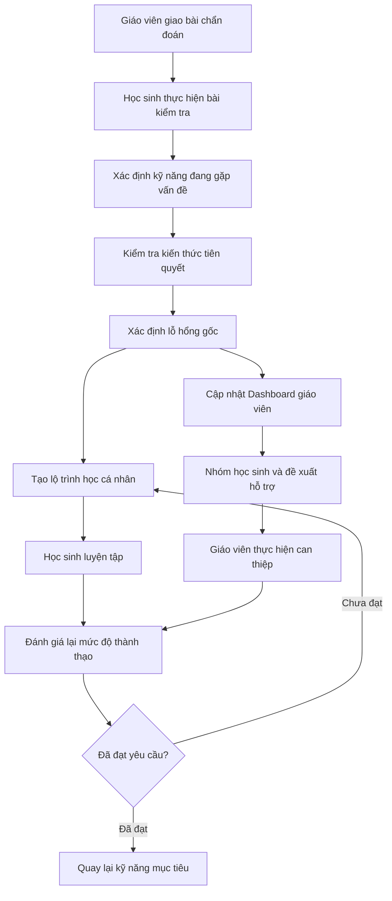

# V-NEXUS SCHOOL: AI-powered Adaptive Learning Platform — Mô tả dự án

## 1. Project Overview

### Tên dự án

**V-NEXUS SCHOOL: AI-powered Adaptive Learning Platform**

### Tagline

**“Mỗi học sinh một lộ trình, mỗi giáo viên một trợ lý.”**
**“Close every learning gap, one root cause at a time.”**

### Mô tả ngắn

V-NEXUS SCHOOL là hệ thống hỗ trợ dạy và học thích ứng bằng AI dành cho các trường học
K12 tại Việt Nam, đặc biệt các trường ở nông thôn, vùng xa. Hệ thống phân tích bài làm,
đối chiếu quan hệ kiến thức tiên quyết để tìm kỹ năng nền còn thiếu, tạo lộ trình luyện
tập phù hợp và cung cấp thông tin có thể hành động cho giáo viên. Mục tiêu là xử lý
nguyên nhân của lỗ hổng thay vì chỉ ghi nhận điểm số hoặc đúng/sai. Với phần nhận xét và
đánh giá học sinh theo định kỳ, AI hỗ trợ giáo viên soạn sẵn nội dung nhận xét — giáo
viên chỉ cần duyệt, bổ sung và chỉnh sửa nếu cần trước khi gửi.

AI đóng vai trò hỗ trợ phân tích, diễn giải và đề xuất. Giáo viên vẫn là người kiểm tra
ngữ cảnh, điều chỉnh khuyến nghị và quyết định hình thức can thiệp cuối cùng. Hệ thống AI
phối hợp với giáo viên, nhà trường và các công cụ vinh danh khen thưởng để tạo ra kết quả
vượt trội cho mỗi học sinh.

### Đối tượng sử dụng

- Các trường K12 trên toàn lãnh thổ Việt Nam, đặc biệt các trường ở nông thôn, vùng xa —
  nơi chênh lệch nền tảng học tập giữa học sinh lớn và điều kiện mạng không ổn định.
- Học sinh tiểu học, chủ yếu lớp 3–4 (phạm vi demo).
- Giáo viên Tiếng Anh cần theo dõi lớp đông, phát hiện nhu cầu cá nhân/nhóm và ưu tiên
  hỗ trợ.
- Nhà trường (Ban giám hiệu) cần tổng quan theo khối/lớp để phát hiện sớm lớp/học sinh
  cần hỗ trợ và dữ liệu phục vụ vinh danh, khen thưởng — đối tượng ra quyết định
  mua/triển khai, khác với giáo viên/học sinh là người dùng hàng ngày.
- Quản trị viên hoặc người quản lý nội dung chịu trách nhiệm chương trình, kỹ năng,
  câu hỏi và kiểm duyệt học liệu.

### Phạm vi MVP chính thức

- Sản phẩm hướng tới tất cả các môn học ở nhà trường, nhưng demo trước ở môn Tiếng Anh.
- Tập trung demo cho học sinh lớp 3–4, với quan hệ kiến thức tiên quyết xuyên hai khối
  lớp, trong khung thời gian khoảng 1 tháng/học kỳ.
- Mạch minh họa: **Từ vựng theo chủ đề → Mẫu câu cơ bản → Đọc hiểu đoạn ngắn**.
- Knowledge Graph rút gọn nhưng thể hiện được quan hệ kiến thức xuyên khối lớp.
- Bài kiểm tra chẩn đoán và chẩn đoán lỗ hổng nguyên nhân.
- Lộ trình luyện tập cá nhân và dashboard học sinh.
- Chấm phát âm: thu âm → nhận diện giọng đọc → so khớp từng từ → điểm % + tô màu từ
  cần sửa + nghe lại mẫu (chỉ chạy khi có mạng).
- Động lực học: coin – XP – huy hiệu sinh từ làm đúng/phát âm đạt/chăm luyện tập; xếp
  hạng theo XP ở phạm vi lớp/trường theo tuần/tháng/học kỳ.
- Dashboard giáo viên, nhóm học sinh, ưu tiên hỗ trợ và phát hiện lỗ hổng chung.
- Dashboard nhà trường: tổng quan khối/lớp một màn hình + bảng vinh danh theo XP.
- Hoạt động cốt lõi trong điều kiện offline hoặc băng thông thấp; đồng bộ khi có mạng.
- Nội dung được mapping với yêu cầu cần đạt của Chương trình GDPT 2018.

### Trạng thái triển khai hiện tại

- **Đã có:** khung chạy thử gồm giao diện chat đơn giản, gateway, một Planner Agent,
  Tool Registry, MCP Server mẫu, kết nối PostgreSQL bất đồng bộ và model mẫu
  `chat_log`.
- **Đang dùng trong source:** Domain Adapter cho SME và các tool minh họa; chưa có
  Domain Adapter/tool nghiệp vụ của Adaptive Tutoring.
- **Chưa được chứng minh là đã hoàn thành:** Knowledge Graph, ngân hàng câu hỏi Tiếng Anh,
  luồng chẩn đoán, lộ trình cá nhân, dashboard học sinh/giáo viên và offline sync.
- **Kế hoạch:** triển khai các chức năng nghiệp vụ trong tài liệu này theo thứ tự phụ
  thuộc được mô tả tại `docs/PLAN.md`.

## 2. Problem Statement

### Khoảng cách năng lực trong cùng một lớp học

Trong một lớp tiểu học khoảng 40 học sinh, các em có thể đang học cùng một bài Tiếng Anh
nhưng có nền tảng rất khác nhau. Một học sinh lớp 4 làm sai câu đọc hiểu có thể không
vướng ở nội dung đoạn văn mà do chưa vững từ vựng theo chủ đề hoặc mẫu câu cơ bản từ
lớp 3. Điểm tổng kết hoặc nhãn đúng/sai không chỉ ra được nguyên nhân này.

### Khó khăn của giáo viên khi quản lý lớp đông

Giáo viên khó đồng thời quan sát từng bài làm, truy ngược kiến thức nền, lập kế hoạch
riêng cho từng em và vẫn bảo đảm tiến độ chung của lớp. Tại khu vực khó khăn, hạn chế
về nhân lực, học liệu và đường truyền càng làm việc phân hóa trở nên khó hơn.

### Hạn chế của lộ trình học cố định

Nhiều ứng dụng yêu cầu mọi học sinh đi qua cùng một chuỗi nội dung. Cách này có thể
buộc học sinh đã thành thạo phải học lại, trong khi học sinh đang thiếu kiến thức nền
lại được đưa tiếp tới bài khó hơn. Hệ thống chỉ tối ưu số bài hoàn thành mà chưa chắc
đã xử lý đúng lỗ hổng.

### Hậu quả đối với các nhóm học sinh

- Học sinh đang gặp khó khăn có thể tích lũy thêm lỗ hổng và dần mất khả năng theo kịp
  bài học hiện tại.
- Học sinh mức trung bình có thể luyện tập nhiều nhưng không cải thiện nếu bài tập
  không nhắm đúng kỹ năng nền.
- Học sinh khá/giỏi bị chậm lại nếu phải học lại nội dung đã thành thạo hoặc không được
  tiếp cận nội dung nâng cao phù hợp.

### Vì sao giáo viên phải ở trung tâm

Dữ liệu bài làm chỉ phản ánh một phần bối cảnh học tập. Giáo viên hiểu mục tiêu tiết
học, hoàn cảnh lớp, lịch sử hỗ trợ và các yếu tố ngoài hệ thống. Vì vậy V-NEXUS SCHOOL
phải đưa ra bằng chứng và khuyến nghị có thể giải thích, còn giáo viên có quyền chấp
nhận, điều chỉnh hoặc từ chối.

## 3. Proposed Solution

### Bạn đang xây dựng cái gì, dành cho ai, và điểm khác biệt là gì

**Đang xây dựng cái gì:** V-NEXUS SCHOOL — nền tảng học tập thích ứng dùng AI cho trường K12,
vận hành vòng lặp chẩn đoán → truy gốc → lộ trình cá nhân → luyện tập → đánh giá lại, có AI hỗ
trợ giáo viên soạn sẵn nhận xét học sinh, có động lực học (coin – XP – huy hiệu), với các hoạt
động cốt lõi chạy được cả khi mạng yếu.

**Dành cho ai:** trường K12 tại Việt Nam, ưu tiên trường ở nông thôn/vùng xa có hạ tầng mạng
hạn chế. Người dùng chính: học sinh (demo lớp 3–4), giáo viên Tiếng Anh quản lý lớp đông và nền
tảng học sinh không đồng đều, Ban giám hiệu cần tổng quan theo khối/lớp, quản trị viên nội dung.

**Điểm khác biệt:**
- Chẩn đoán truy gốc qua đồ thị kiến thức tiên quyết (Knowledge Graph) — không chỉ chấm điểm
  hoặc đúng/sai.
- Lõi luyện tập chạy offline gần như hoàn toàn nhờ nội dung do LLM sinh sẵn trước runtime (giải
  thích, ví dụ, phản hồi theo dạng lỗi) — không phụ thuộc gọi LLM lúc học sinh đang luyện tập.
- Phần lõi chẩn đoán/lộ trình dùng thuật toán minh bạch, giải thích được (Bayesian Knowledge
  Tracing + truy gốc trên đồ thị + topological sort để xếp lộ trình) thay vì một lớp LLM "hộp
  đen" bọc ngoài.
- AI hỗ trợ giáo viên (đề xuất nhận xét học sinh, gợi ý nhóm, xếp ưu tiên hỗ trợ) nhưng giáo
  viên luôn là người duyệt và quyết định cuối cùng trước khi bất kỳ nội dung nào đến tay học
  sinh/phụ huynh.
- Phối hợp với công cụ vinh danh, khen thưởng của nhà trường để tạo động lực học lâu dài, không
  chỉ dừng ở một bài kiểm tra.

### Vòng lặp hỗ trợ học tập

V-NEXUS SCHOOL tổ chức một vòng lặp hỗ trợ học tập liên tục:

1. Học sinh làm bài chẩn đoán do giáo viên giao hoặc tự bắt đầu trong phạm vi cho phép.
2. Hệ thống xác định kỹ năng hiện tại đang gặp vấn đề (target skill).
3. Hệ thống kiểm tra các kiến thức tiên quyết liên quan, kể cả kiến thức ở khối dưới.
4. Khi có đủ bằng chứng, hệ thống xác định lỗ hổng nguyên nhân (root-cause skill); nếu
   chưa đủ, hệ thống tiếp tục kiểm tra thay vì kết luận chắc chắn.
5. Hệ thống tạo lộ trình học từ kỹ năng nền sâu nhất đến kỹ năng mục tiêu.
6. Học sinh xem nội dung, luyện tập và nhận phản hồi theo dạng lỗi.
7. Hệ thống đánh giá lại, cập nhật mức độ thành thạo và điều chỉnh lộ trình.
8. Giáo viên xem dashboard, nhóm học sinh và đề xuất ưu tiên hỗ trợ.
9. Giáo viên thực hiện can thiệp; kết quả trước/sau được theo dõi để quyết định đóng lỗ
   hổng hay tiếp tục điều chỉnh.

Các hoạt động cần thiết được thiết kế cho điều kiện mạng yếu: nội dung/câu hỏi được tải
trước, bài làm được lưu cục bộ và đồng bộ lại. Một số chức năng nâng cao vẫn có thể cần
Internet nên sản phẩm không được mô tả là “offline hoàn toàn”.

Với bản 48h, Knowledge Graph và ngân hàng câu hỏi được LLM sinh và **Business Analyst duyệt
ngoài app** (không xây workflow kiểm duyệt nội dung trong app cho giai đoạn này) — xem chi
tiết ở luồng 5.1/5.2 và mục 8 (Functional Scope).

## 4. Main Users

### 4.1. Học sinh

Học sinh lớp 3–4 cần biết mình đang vướng ở kỹ năng Tiếng Anh nào, vì sao cần học lại
một phần kiến thức nền và bước tiếp theo là gì. Các em có thể làm bài chẩn đoán, theo lộ
trình cá nhân, nhận phản hồi phù hợp lứa tuổi, xem tiến độ của chính mình và tiếp tục học
khi mạng yếu. Mỗi học sinh có một trang "hành trình của em" trả lời 3 câu hỏi: em bắt đầu
từ đâu (mốc xuất phát từ bài đánh giá đầu vào), em đang ở đâu (bản đồ kỹ năng theo mastery
hiện tại, coin/XP/huy hiệu) và em đã tiến bộ thế nào (so sánh mốc xuất phát với hiện tại).
Học sinh không được xem dữ liệu, thứ hạng ưu tiên hay lỗ hổng của học sinh khác.

### 4.2. Giáo viên

Giáo viên Tiếng Anh cần nhìn được cả lớp và từng học sinh mà không phải tự tổng hợp mọi
bài làm. Giáo viên giao bài, xem bằng chứng chẩn đoán, điều chỉnh nhóm, giao bài bổ sung,
ghi nhận can thiệp, đánh dấu khuyến nghị chưa chính xác, theo dõi kết quả sau hỗ trợ, và
**duyệt nhận xét AI soạn sẵn cho từng học sinh** (sửa/bổ sung nếu cần) trước khi gửi.

### 4.3. Quản trị viên/người quản lý nội dung

Nhóm này quản lý môn học, khối lớp, chủ đề, kỹ năng, yêu cầu cần đạt, quan hệ tiên
quyết, câu hỏi và học liệu. Họ chịu trách nhiệm kiểm duyệt chất lượng trước khi nội dung
được dùng để chẩn đoán hoặc luyện tập.

### 4.4. Nhà trường (Ban giám hiệu)

Nhà trường là khách hàng tổ chức, cấp tài khoản cho giáo viên/học sinh và cần một màn
hình tổng quan theo khối/lớp để phát hiện sớm lớp hoặc học sinh cần hỗ trợ, cùng bảng
vinh danh theo XP để tổ chức khen thưởng. Nhà trường cũng xem **tóm tắt điều hành hàng
tuần do AI sinh** bằng ngôn ngữ tự nhiên (VD: "Tuần này khối 4 tiến bộ rõ ở mảng từ vựng;
lớp 4A2 cần chú ý mảng mẫu câu"). Nhà trường không xem lỗ hổng/mức thành thạo chi tiết
của từng học sinh — chỉ số liệu tổng hợp và XP công khai.

Dashboard phụ huynh không thuộc MVP và chỉ được xem xét trong Future Scope.

## 5. Core Functional Flows

> **Sơ đồ BPMN:** xem [`v-nexus-core-flows.drawio`](./v-nexus-core-flows.drawio), gồm 4
> trang tổng hợp và 16 trang swimlane chi tiết tương ứng với từng chức năng từ 5.1 đến
> 5.16.

### 5.1. Quản lý chương trình và Knowledge Graph

**Mục tiêu:** Tạo nền dữ liệu có kiểm duyệt để hệ thống hiểu kỹ năng nào thuộc môn/khối
nào và kỹ năng nào là điều kiện tiên quyết.

**Tác nhân:** Quản trị viên, người quản lý nội dung, chuyên gia môn học.

**Dữ liệu đầu vào:** Môn học, khối lớp, chủ đề, kỹ năng, yêu cầu cần đạt của GDPT 2018,
quan hệ tiên quyết và trạng thái kiểm duyệt.

**Luồng xử lý chính:**

1. Tạo môn Tiếng Anh, các khối 3–4 và các chủ đề trong phạm vi MVP.
2. Tạo kỹ năng với mã nội bộ, tên, mô tả và khối lớp tham chiếu.
3. Mapping kỹ năng với yêu cầu cần đạt tương ứng của GDPT 2018.
4. Thiết lập quan hệ tiên quyết, cho phép kỹ năng lớp 4 phụ thuộc kỹ năng nền lớp 3.
5. Chuyên gia rà soát tính đúng đắn, tính đầy đủ và nguy cơ tạo vòng lặp.
6. Chỉ công bố phiên bản đã được phê duyệt.

**Kết quả đầu ra:** Danh mục kỹ năng và Knowledge Graph có phiên bản, có thể dùng cho
gắn nhãn câu hỏi, chẩn đoán và tạo lộ trình.

**Trường hợp đặc biệt hoặc điều kiện xử lý:** Không gọi mã kỹ năng nội bộ là “mã bài
học chính thức”. Quan hệ tạo chu trình, kỹ năng chưa mapping yêu cầu cần đạt hoặc chưa
kiểm duyệt không được dùng trong chẩn đoán chính thức.

**Ghi chú phạm vi 48h:** Đồ thị kỹ năng (khoảng 70 node cho mạch demo) được LLM hỗ trợ
sinh, Business Analyst rà soát và duyệt **ngoài app** (VD trên spreadsheet/tài liệu), rồi
nạp vào hệ thống qua script import. Bản 48h **không xây UI/workflow kiểm duyệt trong app**
cho bước này — chỉ dữ liệu đã duyệt offline mới được nạp và dùng để chẩn đoán.

### 5.2. Quản lý ngân hàng câu hỏi

**Mục tiêu:** Bảo đảm mỗi câu hỏi cung cấp bằng chứng phù hợp về một hoặc nhiều kỹ năng.

**Tác nhân:** Người quản lý nội dung, giáo viên, chuyên gia môn học.

**Dữ liệu đầu vào:** Nội dung câu hỏi, loại câu hỏi, đáp án, lời giải, độ khó, kỹ năng
được đo, trọng số liên quan, các phương án sai và dạng lỗi phổ biến.

**Luồng xử lý chính:**

1. Tạo câu hỏi và đáp án/lời giải.
2. Gắn câu hỏi với một hoặc nhiều kỹ năng và chỉ rõ kỹ năng chính nếu cần.
3. Xác định độ khó và mục đích: thăm dò, chẩn đoán, luyện tập hoặc kiểm tra lại.
4. Mapping phương án sai với dạng lỗi phổ biến khi có bằng chứng chuyên môn.
5. Giáo viên hoặc người quản lý nội dung rà soát tính đúng, rõ và phù hợp độ tuổi.
6. Phê duyệt trước khi đưa câu hỏi vào bài làm thực tế.

**Kết quả đầu ra:** Ngân hàng câu hỏi có trạng thái kiểm duyệt và đủ metadata để chọn
câu hỏi, phân tích lỗi và giải thích kết quả.

**Trường hợp đặc biệt hoặc điều kiện xử lý:** Câu hỏi chưa duyệt chỉ dùng để biên tập;
câu hỏi mơ hồ, có nhiều đáp án hợp lệ hoặc mapping kỹ năng chưa chắc chắn phải trả lại
để chỉnh sửa.

**Ghi chú phạm vi 48h:** Câu hỏi (kể cả phương án sai/distractor và phản hồi theo dạng
lỗi) do LLM sinh, BA/giáo viên duyệt **ngoài app**, tương tự đồ thị kỹ năng ở 5.1 — không
xây workflow kiểm duyệt trong app cho giai đoạn này.

### 5.3. Bài kiểm tra chẩn đoán

**Mục tiêu:** Thu thập đủ bằng chứng để xác định kỹ năng đang gặp vấn đề và kiểm tra
các kiến thức tiên quyết liên quan.

**Tác nhân:** Học sinh, giáo viên.

**Dữ liệu đầu vào:** Bài được giao hoặc mục tiêu chẩn đoán, danh sách kỹ năng, câu hỏi
đã duyệt, giới hạn số câu/thời gian và lịch sử kết quả liên quan.

**Luồng xử lý chính:**

1. Giáo viên giao bài hoặc học sinh bắt đầu bài chẩn đoán được phép (tối đa **20 câu/phiên**).
2. Hệ thống chọn câu hỏi theo kỹ năng cần kiểm tra.
3. Với mỗi câu trả lời, lưu kết quả, thời gian trả lời, số lần thử và số lần dùng gợi ý.
4. Nếu học sinh sai, hệ thống chọn câu hỏi thăm dò kỹ năng tiên quyết liên quan, kể cả
   kiến thức ở khối dưới, cho đến khi tìm được tầng sâu nhất còn vững (ngưỡng 2/3 câu
   đúng ở tầng đó).
5. Tiếp tục hỏi cho đến khi đủ bằng chứng hoặc đạt giới hạn câu hỏi/thời gian.
6. Kết thúc và chuyển dữ liệu sang bước chẩn đoán nguyên nhân.

**Kết quả đầu ra:** Một lần làm bài có chuỗi câu hỏi thực tế, câu trả lời và bằng chứng
đủ để phân tích hoặc trạng thái “cần kiểm tra thêm”.

**Trường hợp đặc biệt hoặc điều kiện xử lý:** Mất mạng không làm mất bài; câu bỏ trống,
thoát giữa chừng hoặc dùng gợi ý nhiều phải được ghi nhận. Không suy diễn chắc chắn từ
quá ít câu hỏi.

### 5.4. Chẩn đoán lỗ hổng nguyên nhân

**Mục tiêu:** Phân biệt kỹ năng đang làm sai với kỹ năng nền gây ra lỗi.

**Tác nhân:** Hệ thống hỗ trợ phân tích; giáo viên là người xem xét kết luận.

**Dữ liệu đầu vào:** Bài làm, dạng lỗi, thời gian/gợi ý/lần thử, Knowledge Graph và lịch
sử thành thạo liên quan.

**Luồng xử lý chính:**

1. Xác định **target skill**: kỹ năng biểu hiện lỗi trong bài đang làm.
2. Truy ngược các kỹ năng tiên quyết của target skill.
3. Tổng hợp bằng chứng ủng hộ hoặc phản bác từng kỹ năng nền.
4. Xác định **root-cause skill** sâu nhất có đủ bằng chứng.
5. Xác định khối lớp tham chiếu, mức thành thạo, độ tin cậy và các kỹ năng phía sau bị
   ảnh hưởng.
6. Tạo phần giải thích liên kết trực tiếp tới bằng chứng.

**Kết quả đầu ra:** Target skill, root-cause skill, khối lớp phát sinh lỗ hổng, mức độ
thành thạo, độ tin cậy, bằng chứng và danh sách kỹ năng bị ảnh hưởng.

**Trường hợp đặc biệt hoặc điều kiện xử lý:** Nếu bằng chứng mâu thuẫn hoặc chưa đủ,
kết quả phải là “chưa đủ bằng chứng” kèm đề xuất câu hỏi kiểm tra thêm; không đưa ra kết
luận chắc chắn. Giáo viên có thể đánh dấu kết luận chưa chính xác.

**AI sử dụng:** chọn câu hỏi và truy gốc là **thuật toán tự build trên đồ thị kiến thức**
(không gọi LLM khi chọn câu — nhanh, rẻ, chạy offline được, minh bạch với người chấm). LLM
chỉ được gọi **một lần khi kết thúc phiên** để diễn giải kết quả thành 2 phiên bản lời:
cho học sinh (giọng khích lệ, hình ảnh hóa) và cho giáo viên (thuật ngữ chuyên môn, nêu
bằng chứng). Khi LLM lỗi, diễn giải rơi về template câu có sẵn ghép với tên kỹ năng.

### 5.5. Tạo lộ trình học cá nhân

**Mục tiêu:** Lấp lỗ hổng theo đúng thứ tự phụ thuộc và tránh học lại phần đã thành thạo.

**Tác nhân:** Hệ thống đề xuất; giáo viên có thể điều chỉnh; học sinh thực hiện.

**Dữ liệu đầu vào:** Root-cause skill, target skill, Knowledge Graph, mức thành thạo,
nội dung/câu hỏi đã duyệt và lịch sử học gần nhất.

**Luồng xử lý chính:**

1. Bắt đầu từ lỗ hổng sâu nhất có đủ bằng chứng.
2. Bỏ qua kỹ năng đã đạt yêu cầu và sắp các bước theo quan hệ tiên quyết.
3. Chọn nội dung giải thích, ví dụ và bài tập tăng dần độ khó.
4. Thêm bước kiểm tra lại sau từng kỹ năng.
5. Khi kiến thức nền đạt yêu cầu, đưa học sinh quay lại target skill.
6. Điều chỉnh lộ trình khi có kết quả mới hoặc khi giáo viên can thiệp.

**Kết quả đầu ra:** Chuỗi bước cá nhân có mục tiêu, trạng thái và điều kiện chuyển bước
rõ ràng.

**Trường hợp đặc biệt hoặc điều kiện xử lý:** Nếu thiếu nội dung đã duyệt cho một kỹ
năng, lộ trình phải báo thiếu dữ liệu và không tự chèn nội dung không kiểm chứng. Giáo
viên có thể thay đổi hoặc giao thêm bài.

**AI sử dụng:** xếp thứ tự các bước trong lộ trình là **topological sort** (thuật toán,
không gọi LLM lúc runtime). Toàn bộ nội dung "trí tuệ" của luồng này — giải thích ngắn cho
từng kỹ năng, ví dụ minh họa, bài luyện tập tăng dần độ khó, và đặc biệt phản hồi theo
dạng lỗi cho từng phương án sai (distractor) — được LLM sinh **trước runtime** và gắn sẵn
vào ngân hàng câu hỏi. Nhờ vậy học sinh vẫn nhận phản hồi phù hợp ngay cả khi offline, mà
không cần gọi mô hình lúc luyện tập.

### 5.6. Học sinh thực hiện lộ trình

**Mục tiêu:** Giúp học sinh hiểu điều cần cải thiện, luyện tập đúng trọng tâm và thấy
tiến độ của chính mình.

**Tác nhân:** Học sinh.

**Dữ liệu đầu vào:** Lộ trình đã tạo, nội dung giải thích/ví dụ, bài tập, phản hồi theo
dạng lỗi và dữ liệu tiến độ.

**Luồng xử lý chính:**

1. Học sinh xem kỹ năng cần cải thiện và lý do ở mức phù hợp lứa tuổi.
2. Xem nội dung giải thích hoặc ví dụ.
3. Làm bài luyện tập từ mức phù hợp.
4. Nhận phản hồi gắn với loại lỗi, không chỉ đáp án đúng.
5. Xem tiến độ và thực hiện bước kiểm tra lại.
6. Theo kết quả, tiếp tục, học lại hoặc chuyển sang kỹ năng tiếp theo.

**Kết quả đầu ra:** Bài làm, tiến độ, trạng thái từng bước và bằng chứng mới để cập nhật
mức thành thạo.

**Trường hợp đặc biệt hoặc điều kiện xử lý:** Nếu học sinh liên tục thất bại, hệ thống
giảm độ khó hoặc báo cần hỗ trợ thay vì lặp vô hạn. Khi offline, dữ liệu phải được giữ
trên thiết bị để đồng bộ sau (PWA + IndexedDB — xem 5.12).

**Hành trình của em:** ngoài luyện tập, học sinh có một trang riêng trả lời 3 câu hỏi: em
bắt đầu từ đâu (mốc từ bài đánh giá đầu vào), em đang ở đâu (bản đồ kỹ năng tô đỏ/vàng/xanh
theo mastery hiện tại + coin/XP/huy hiệu/hạng tuần), và em đã tiến bộ thế nào (biểu đồ so
sánh mốc xuất phát với hiện tại). Luôn hiển thị "nhiệm vụ tiếp theo" để mỗi lần mở app học
sinh biết ngay cần làm gì. Dashboard của học sinh chỉ nói về chính em, không so sánh với
bạn khác — mọi nhãn có audio, chữ tối thiểu, phù hợp lứa tuổi 8–9.

**AI sử dụng:** tổng hợp tiến bộ, so sánh mốc và chọn "nhiệm vụ tiếp theo" là thuật toán
trên dữ liệu mastery — chạy offline 100%. Lời diễn giải thân thiện với trẻ (VD: "Tuần này
em giỏi hơn ở chủ đề Màu sắc rồi!") lấy từ kho câu LLM sinh sẵn theo mẫu, ghép với tên kỹ
năng lúc runtime — không gọi mô hình.

### 5.7. Dashboard giáo viên

**Mục tiêu:** Biến dữ liệu chẩn đoán thành quyết định hỗ trợ cá nhân, theo nhóm hoặc cả
lớp.

**Tác nhân:** Giáo viên được phân công lớp.

**Dữ liệu đầu vào:** Danh sách lớp, bài làm, mức thành thạo, diagnosed gaps, lộ trình,
nhóm, mức ưu tiên và lịch sử can thiệp.

**Luồng xử lý chính:**

1. Hiển thị heatmap lớp × kỹ năng (tổng quan mức thành thạo của lớp theo từng kỹ năng).
2. Cho phép xem lỗ hổng và bằng chứng của từng học sinh (drill-down).
3. Hiển thị học sinh cần hỗ trợ trước và lý do.
4. Hiển thị nhóm có cùng nhu cầu (3 loại: học lại nền / luyện thêm / nâng cao) và kỹ năng
   có tỷ lệ chưa đạt cao.
5. Đề xuất hỗ trợ cá nhân, theo nhóm hoặc dạy lại cả lớp, kèm 2–3 gợi ý hoạt động phụ
   đạo cụ thể cho mỗi nhóm.
6. Giáo viên bấm nút để hệ thống sinh **nhận xét AI** cho từng học sinh (3–4 câu: khen
   tiến bộ → nêu điểm cần cải thiện bằng ngôn ngữ tích cực → đề xuất việc phụ huynh có thể
   làm cùng con); giáo viên sửa và duyệt trước khi gửi.
7. Cho phép giáo viên chấp nhận/từ chối khuyến nghị, điều chỉnh nhóm, giao bài bổ sung,
   ghi nhận can thiệp và đánh dấu kết luận chưa chính xác.
8. Theo dõi kết quả sau can thiệp.

**Kết quả đầu ra:** Dashboard có thể hành động, có drill-down tới bằng chứng, nhận xét AI
với trạng thái "AI đề xuất / GV đã duyệt", và ghi lại quyết định của giáo viên.

**Trường hợp đặc biệt hoặc điều kiện xử lý:** Giáo viên chỉ được xem lớp được phân
công. Dữ liệu chưa đồng bộ hoặc bằng chứng yếu phải có chỉ báo rõ; không hiển thị xếp
hạng thiếu giải thích. Nhận xét AI chưa được giáo viên duyệt không được gửi cho phụ huynh.

**AI sử dụng:** gom nhóm (theo root-cause chung), xếp ưu tiên (độ sâu lỗ hổng × số kỹ năng
bị ảnh hưởng) và cảnh báo lớp là **thuật toán** — luôn chạy được kể cả khi LLM lỗi. LLM
runtime đảm nhận 2 việc: (1) sinh nhận xét cá nhân hóa từng em từ bản đồ lỗ hổng, tiến bộ 2
tuần gần nhất và coin/huy hiệu đạt được; (2) gợi ý 2–3 hoạt động phụ đạo cụ thể cho mỗi
nhóm dựa trên kỹ năng chung của nhóm. Khi LLM lỗi: dùng khung nhận xét template để giáo
viên tự điền; nhóm/ưu tiên vẫn hiển thị bình thường vì đó là thuật toán.

### 5.8. Tự động nhóm học sinh

**Mục tiêu:** Giúp giáo viên tổ chức hỗ trợ hiệu quả cho học sinh có nhu cầu tương đồng.

**Tác nhân:** Hệ thống đề xuất; giáo viên kiểm tra và điều chỉnh.

**Dữ liệu đầu vào:** Root-cause gaps, target skills, mức thành thạo, kết quả luyện tập
và lớp học hiện tại.

**Luồng xử lý chính:**

1. So sánh lỗ hổng của các học sinh trong cùng lớp.
2. Gom theo kỹ năng cần cải thiện và loại nhu cầu.
3. Phân biệt nhóm cần học lại kiến thức nền, nhóm cần luyện thêm và nhóm cần nội dung
   nâng cao.
4. Hiển thị tiêu chí hình thành nhóm cho giáo viên.
5. Cho phép giáo viên thêm/bớt thành viên.
6. Cập nhật nhóm khi kết quả mới thay đổi nhu cầu.

**Kết quả đầu ra:** Danh sách nhóm có mục tiêu, thành viên, lý do và trạng thái.

**Trường hợp đặc biệt hoặc điều kiện xử lý:** Một học sinh có thể có nhiều nhu cầu
nhưng không nên bị gắn nhãn cố định. Nhóm quá nhỏ/lớn hoặc có bằng chứng yếu phải được
đưa cho giáo viên xem xét.

**AI sử dụng:** gom nhóm theo root-cause chung là thuật toán. LLM runtime gợi ý thêm 2–3
hoạt động phụ đạo cụ thể cho mỗi nhóm dựa trên kỹ năng chung (VD: trò chơi flashcard bộ
phận cơ thể cho nhóm hổng "G3U04 — bộ phận cơ thể"); khi LLM lỗi, nhóm vẫn hiển thị đầy đủ
vì việc gom nhóm không phụ thuộc LLM.

### 5.9. Xếp mức độ ưu tiên hỗ trợ

**Mục tiêu:** Giúp giáo viên biết trường hợp nào cần can thiệp trước mà không chỉ dựa
trên điểm thấp.

**Tác nhân:** Hệ thống đề xuất; giáo viên quyết định.

**Dữ liệu đầu vào:** Mức nghiêm trọng, số kỹ năng bị ảnh hưởng, mức liên quan với bài
đang học, thời gian mắc kẹt, kết quả nhiều lần luyện tập và lịch sử hỗ trợ.

**Luồng xử lý chính:**

1. Tổng hợp các yếu tố ưu tiên cho từng học sinh/gap.
2. Loại bỏ trường hợp đã đạt yêu cầu hoặc dữ liệu quá cũ.
3. Xếp mức ưu tiên và tạo phần giải thích theo từng yếu tố.
4. Hiển thị cùng trạng thái đã/chưa được giáo viên hỗ trợ.
5. Cập nhật khi có bài làm hoặc can thiệp mới.

**Kết quả đầu ra:** Danh sách ưu tiên kèm lý do có thể kiểm tra, không phải nhãn năng
lực cố định.

**Trường hợp đặc biệt hoặc điều kiện xử lý:** Thiếu dữ liệu phải làm giảm độ chắc chắn;
giáo viên có thể thay đổi thứ tự theo bối cảnh thực tế và quyết định này được ghi nhận.

### 5.10. Phát hiện lỗ hổng chung của lớp

**Mục tiêu:** Xác định khi nào cần hỗ trợ cá nhân, phụ đạo nhóm hoặc dạy lại cả lớp.

**Tác nhân:** Hệ thống tổng hợp; giáo viên quyết định áp dụng.

**Dữ liệu đầu vào:** Kết quả theo kỹ năng, số học sinh có đủ bằng chứng, tỷ lệ chưa đạt
và nội dung lớp đang học.

**Luồng xử lý chính:**

1. Tổng hợp kết quả theo từng kỹ năng trong lớp.
2. Tính tỷ lệ học sinh chưa đạt trên tập dữ liệu hợp lệ.
3. Nếu chỉ ít học sinh gặp vấn đề, đề xuất hỗ trợ cá nhân.
4. Nếu một nhóm đáng kể gặp cùng vấn đề, đề xuất phụ đạo theo nhóm.
5. Nếu phần lớn lớp cùng gặp vấn đề, đề xuất dạy lại cả lớp.
6. Giáo viên xem bằng chứng và quyết định.

**Kết quả đầu ra:** Danh sách kỹ năng phổ biến, phạm vi ảnh hưởng và hình thức hỗ trợ
đề xuất.

**Trường hợp đặc biệt hoặc điều kiện xử lý:** Ngưỡng phải được thống nhất theo bối cảnh,
không cố định tùy tiện. Dữ liệu chưa đồng bộ hoặc quá ít học sinh có bằng chứng không
được dùng để kết luận cho cả lớp.

### 5.11. Ghi nhận can thiệp của giáo viên

**Mục tiêu:** Lưu được hành động sư phạm và đánh giá hiệu quả trước/sau.

**Tác nhân:** Giáo viên.

**Dữ liệu đầu vào:** Học sinh/nhóm, gap mục tiêu, kết quả trước can thiệp, hình thức hỗ
trợ, nội dung dạy lại và bài kiểm tra lại.

**Luồng xử lý chính:**

1. Giáo viên chọn học sinh hoặc nhóm cần hỗ trợ.
2. Chọn hình thức và ghi nội dung đã dạy lại.
3. Giao bài luyện tập hoặc kiểm tra lại.
4. So sánh kết quả trước và sau can thiệp.
5. Đóng gap nếu đạt yêu cầu; nếu chưa đạt, tiếp tục điều chỉnh lộ trình hoặc hình thức
   hỗ trợ.

**Kết quả đầu ra:** Nhật ký can thiệp, kết quả trước/sau và trạng thái gap.

**Trường hợp đặc biệt hoặc điều kiện xử lý:** Không tự quy kết cải thiện chỉ do một can
thiệp khi chưa đủ dữ liệu. Can thiệp chưa có bài kiểm tra lại giữ trạng thái đang theo
dõi.

**Ghi chú phạm vi 48h:** Đây là hạng mục **P2** cho bản 48h — trong phạm vi demo có thể
dùng mock/dữ liệu seed để kể câu chuyện trước/sau, không bắt buộc build đầy đủ logic ghi
nhận can thiệp thật (xem mục 8).

### 5.12. Offline và đồng bộ

**Mục tiêu:** Không làm gián đoạn bài chẩn đoán/luyện tập khi mạng yếu và không làm mất
dữ liệu học sinh.

**Tác nhân:** Học sinh, giáo viên gián tiếp qua dữ liệu sau đồng bộ.

**Dữ liệu đầu vào:** Gói nội dung/câu hỏi cần thiết, bài được giao, bài làm cục bộ và
trạng thái đồng bộ.

**Luồng xử lý chính:**

1. Khi có mạng, thiết bị tải nội dung và câu hỏi cần thiết.
2. Học sinh làm bài hoặc luyện tập khi mất mạng.
3. Kết quả được lưu cục bộ và hiển thị trạng thái chưa đồng bộ.
4. Khi có mạng, hệ thống tự động thử đồng bộ.
5. Giáo viên xem dữ liệu sau khi đồng bộ thành công.
6. Nếu lỗi, dữ liệu vẫn được giữ lại để thử lại và người dùng được thông báo phù hợp.

**Kết quả đầu ra:** Bài làm không bị mất, trạng thái đồng bộ rõ ràng và dữ liệu hợp
nhất để dashboard sử dụng.

**Trường hợp đặc biệt hoặc điều kiện xử lý:** Tránh tạo trùng khi thử lại. Xung đột dữ
liệu cần được phát hiện và xử lý theo quy tắc đã thống nhất. Không mô tả toàn hệ thống
là offline hoàn toàn nếu kiểm duyệt, phân tích nâng cao hoặc đồng bộ vẫn cần Internet.

**Công nghệ cụ thể:** PWA (Progressive Web App) + IndexedDB lưu cục bộ trên thiết bị; mọi
đề bài luyện tập có audio TTS sinh sẵn trong bước chuẩn bị nội dung, không cần gọi dịch vụ
audio lúc offline (xem chi tiết hạ tầng ở `docs/plan-offline-mode.md`).

### 5.13. Chấm phát âm

**Mục tiêu:** Cho học sinh phản hồi tức thì về phát âm ở mức từng từ, không chỉ đúng/sai
cả câu.

**Tác nhân:** Học sinh; giáo viên xem qua hồ sơ tiến bộ.

**Dữ liệu đầu vào:** Câu mẫu đã có audio TTS, bản ghi âm giọng đọc của học sinh.

**Luồng xử lý chính:**

1. Học sinh nghe câu mẫu, thu âm giọng đọc của mình.
2. Hệ thống nhận diện lời đọc (STT) và so khớp từng từ với câu gốc, có dung sai cho
   giọng trẻ em.
3. Trả về điểm phần trăm, tô màu từ cần sửa, cho nghe lại giọng mẫu và đọc lại.
4. Đạt ngưỡng thì cộng coin; kết quả góp vào hồ sơ tiến bộ của học sinh.

**Kết quả đầu ra:** Điểm phát âm, danh sách từ sai/đúng theo lượt đọc, coin nếu đạt
ngưỡng.

**Trường hợp đặc biệt hoặc điều kiện xử lý:** Chỉ chạy khi có mạng (phụ thuộc dịch vụ
STT) — khi offline, ẩn nút phát âm và xếp câu vào hàng đợi luyện lại khi có mạng. Không
tô đỏ biến thể phát âm gần đúng, chỉ tô từ sai hẳn hoặc bị bỏ sót.

**Công nghệ cụ thể:** STT dùng Web Speech API (nhanh, miễn phí), dự phòng Whisper API nếu
độ chính xác với giọng trẻ em không đạt. Âm mẫu để nghe lại là TTS sinh sẵn từ bước chuẩn
bị nội dung. Lời khen/động viên sau mỗi lượt lấy từ kho LLM sinh sẵn theo mức điểm — không
gọi LLM runtime cho phần này.

### 5.14. Động lực học: coin – XP – huy hiệu

**Mục tiêu:** Duy trì động lực luyện tập đều đặn bằng ghi nhận có thể nhìn thấy, không
so sánh năng lực.

**Tác nhân:** Học sinh; nhà trường dùng để vinh danh.

**Dữ liệu đầu vào:** Kết quả làm đúng, điểm phát âm đạt ngưỡng, tần suất luyện tập.

**Luồng xử lý chính:**

1. Sinh coin khi làm đúng câu hỏi, đạt ngưỡng phát âm hoặc chăm luyện tập đều.
2. Tích lũy XP song song với coin; mở huy hiệu khi đạt mốc XP.
3. Xếp hạng theo XP ở phạm vi lớp/trường theo tuần/tháng/học kỳ.
4. Nhà trường dùng bảng xếp hạng để vinh danh; coin dùng để đổi quà tại gian hàng
   (xem 5.16).

**Kết quả đầu ra:** Số dư coin, XP tích lũy, danh sách huy hiệu đã mở, vị trí xếp hạng.

**Trường hợp đặc biệt hoặc điều kiện xử lý:** Luật coin/XP/huy hiệu chạy offline 100%
(thuần thuật toán). Xếp hạng công khai chỉ phản ánh XP (nỗ lực) — tuyệt đối không xếp
hạng công khai theo mức thành thạo hay lỗ hổng, để tránh gắn nhãn năng lực.

**AI sử dụng:** luật coin/XP/huy hiệu thuần thuật toán, chạy offline 100%, không có lời
gọi AI nào lúc runtime trong luồng này. LLM chỉ tham gia **trước runtime**: đặt tên và mô
tả bộ huy hiệu theo chủ đề gần gũi với trẻ, và sinh kho khoảng 50 lời chúc mừng đa dạng để
không lặp lại nhàm chán.

### 5.15. Dashboard nhà trường & xếp hạng

**Mục tiêu:** Cho nhà trường một màn hình tổng quan để phát hiện sớm lớp cần hỗ trợ và
tổ chức vinh danh.

**Tác nhân:** Nhà trường (Ban giám hiệu).

**Dữ liệu đầu vào:** Mức thành thạo tổng hợp theo khối/lớp, XP theo học sinh/lớp, cảnh
báo tỷ lệ chưa đạt theo kỹ năng.

**Luồng xử lý chính:**

1. Tổng hợp mức thành thạo theo khối/lớp.
2. Hiển thị bảng vinh danh XP theo tuần/tháng/học kỳ.
3. Cảnh báo lớp có tỷ lệ chưa đạt cao ở một kỹ năng để ưu tiên hỗ trợ.
4. Sinh **tóm tắt điều hành hàng tuần bằng AI** (VD: "Tuần này khối 4 tiến bộ rõ ở mảng từ
   vựng; lớp 4A2 cần chú ý mảng mẫu câu — 65% học sinh chưa đạt kỹ năng hỏi giờ").
5. Không hiển thị lỗ hổng/mức thành thạo chi tiết của từng học sinh cho vai trò này.

**Kết quả đầu ra:** Một màn hình tổng quan khối/lớp, bảng vinh danh, tóm tắt điều hành
hàng tuần và cảnh báo lớp cần chú ý.

**Trường hợp đặc biệt hoặc điều kiện xử lý:** Chỉ hiển thị số liệu tổng hợp; dữ liệu
chưa đồng bộ phải được đánh dấu rõ, không dùng để kết luận vội.

**AI sử dụng:** số liệu và cảnh báo là thuật toán tổng hợp — luôn chạy được. LLM sinh 1
đoạn tóm tắt điều hành mỗi tuần bằng ngôn ngữ tự nhiên (điểm nhấn demo cho vai Ban giám
hiệu); khi LLM lỗi, chỉ hiển thị số liệu, ẩn phần tóm tắt.

### 5.16. Gian hàng đổi quà (P2)

**Mục tiêu:** Biến coin tích lũy thành phần thưởng thật do nhà trường tổ chức.

**Tác nhân:** Học sinh đổi quà; nhà trường quản lý gian hàng.

**Dữ liệu đầu vào:** Số dư coin của học sinh, danh mục quà và số lượng còn lại.

**Luồng xử lý chính:**

1. Học sinh xem danh mục quà và số coin cần để đổi.
2. Chọn quà, trừ coin nếu đủ số dư.
3. Nhà trường ghi nhận quà đã phát cho học sinh.

**Kết quả đầu ra:** Lịch sử đổi quà theo học sinh, số dư coin cập nhật.

**Trường hợp đặc biệt hoặc điều kiện xử lý:** Đây là P2 — trong phạm vi demo dùng mock
1 màn hình với dữ liệu seed, không bắt buộc build logic trừ kho/tồn kho thật.

## 6. End-to-End User Journey

Vòng lặp kết thúc theo từng gap khi học sinh đạt yêu cầu ở kỹ năng nền và thể hiện lại
được năng lực ở kỹ năng mục tiêu; kết quả mới vẫn tiếp tục được theo dõi.

## 7. Demo Scenario

Kịch bản demo 5 phút, xoay quanh một học sinh mẫu ("bé An", lớp 4):

1. Bé An làm bài đánh giá đầu vào, trả lời sai câu tả ngoại hình (miêu tả người/vật bằng
   Tiếng Anh).
2. Hệ thống truy gốc: kiểm tra các kỹ năng tiên quyết liên quan, kể cả kiến thức lớp dưới.
3. Bằng chứng cho thấy bé An hổng ở **"bộ phận cơ thể"** (lớp 3, Unit 4) và **"màu sắc"**
   (lớp 3, Unit 9); nền câu mẫu "He/She is my..." đã vững.
4. Lộ trình cá nhân hiện ra, bắt đầu từ 2 lỗ hổng gốc này. Bật airplane mode: bé An luyện
   từ vựng bình thường, phản hồi lỗi vẫn thông minh (khoảnh khắc offline — nội dung/phản
   hồi đã được sinh sẵn trước, không cần mạng).
5. Bật mạng lại: luyện chấm phát âm — đọc câu mẫu, hệ thống tô màu từ sai, đọc lại đạt →
   cộng coin, lên huy hiệu.
6. Vai giáo viên: xem heatmap lớp, 3 nhóm gợi ý sẵn kèm hoạt động phụ đạo cụ thể; bấm nút
   để AI sinh nhận xét cho bé An, giáo viên sửa một câu rồi duyệt gửi.
7. Vai nhà trường: xem tổng quan khối, tóm tắt tuần do AI sinh, và bảng vinh danh XP.
8. Chốt demo: giới thiệu gian hàng đổi quà (mock) và roadmap mở rộng sang khối lớp/môn
   học khác.

Kịch bản demo không tuyên bố tỷ lệ chính xác, mức cải thiện hoặc hiệu quả thực nghiệm
khi chưa có dữ liệu thử nghiệm được kiểm chứng.

## 8. Functional Scope

Bảng dưới chia theo mức ưu tiên cho bản 48h (P0 = bắt buộc build thật, P1 = nên có nếu còn
thời gian, P2 = kể chuyện được bằng mock, không bắt buộc build logic thật). **Nguyên tắc cắt
scope:** thứ gì BGK chấm thì build thật (chẩn đoán, dashboard giáo viên, offline, phát âm);
thứ gì kể chuyện được thì mock đẹp (gian hàng, import CSV).

### 8.1. Bắt buộc cho MVP (P0)

- Đồ thị kỹ năng (~70 node, xem `skill_graph_seed.json`) + ngân hàng câu hỏi: LLM sinh, BA
  duyệt **ngoài app** — không xây workflow kiểm duyệt trong app cho bản 48h.
- Đánh giá đầu vào thích ứng (tối đa 20 câu/phiên) + truy gốc + bản đồ lỗ hổng; trạng thái
  "cần kiểm tra thêm" khi thiếu bằng chứng.
- Lộ trình cá nhân + luyện tập offline: từ vựng, mẫu câu, quiz (PWA + IndexedDB, mọi đề
  bài có audio TTS sinh sẵn).
- Chấm phát âm: thu âm → STT → so khớp từng từ → điểm % + tô màu từ sai + nghe lại mẫu
  (chỉ chạy khi có mạng, nói rõ khi pitch).
- Coin + XP + huy hiệu (coin khi làm đúng, phát âm đạt, chăm luyện; huy hiệu theo mốc XP).
- Dashboard giáo viên: heatmap lớp × kỹ năng, gom nhóm gợi ý (3 loại: học lại nền / luyện
  thêm / nâng cao), xếp ưu tiên kèm lý do, nút AI sinh nhận xét từng em (giáo viên sửa và
  duyệt trước khi gửi).
- Phân quyền: học sinh chỉ xem dữ liệu của mình; giáo viên chỉ xem lớp được phân công.

### 8.2. Nên có (P1) và có thể mock (P2)

**P1 — nên có nếu còn thời gian sau P0:**
- Xếp hạng theo XP: lớp/trường theo tuần/tháng/học kỳ; dashboard nhà trường 1 màn hình
  (tổng quan khối/lớp + bảng vinh danh + cảnh báo lớp có tỷ lệ chưa đạt cao).
- Trang hồ sơ/hành trình học sinh: xuất phát điểm → hiện tại → biểu đồ tiến bộ; giáo viên
  chỉnh nhóm, đánh dấu kết luận chưa chính xác.
- Hội thoại đóng vai với AI theo tình huống Unit (chỉ làm nếu P0 xong sớm).

**P2 — kể chuyện bằng mock, không bắt buộc build logic thật:**
- Gian hàng đổi quà bằng coin (1 màn hình mock, dữ liệu seed).
- Import danh mục quà bằng CSV (demo dùng dữ liệu seed, không cần import thật).
- Ghi nhận can thiệp của giáo viên trước/sau (mock để kể chuyện trong pitch).

### 8.3. Mở rộng tương lai

- Dashboard phụ huynh.
- Chatbot hỏi đáp nâng cao.
- Mở rộng Tiếng Anh sang các khối lớp ngoài lớp 3–4.
- Mở rộng sang các môn học khác.
- Placement test bốn kỹ năng ở giai đoạn phù hợp.
- Đánh giá kỹ năng nói toàn diện (hội thoại tự do, ngữ điệu) vượt ngoài chấm phát âm
  từng từ đã có ở MVP.
- Xây workflow kiểm duyệt nội dung (Knowledge Graph, ngân hàng câu hỏi) **trong app** —
  bản 48h duyệt hoàn toàn ngoài app.
- Gian hàng đổi quà với quản lý tồn kho/import CSV thật (MVP chỉ mock).

## 9. AI Roles and Boundaries

### Bản đồ AI toàn hệ thống — 3 tầng

Hệ thống dùng 3 tầng AI, là hợp đồng chung cho cả team khi code fallback:

1. **LLM sinh nội dung trước runtime** — đóng gói offline: sinh câu hỏi + distractor gắn
   dạng lỗi, TTS sinh audio mẫu, giải thích/ví dụ cho từng kỹ năng, kho lời khen và tên
   huy hiệu. Người duyệt trước khi dùng; không ảnh hưởng runtime vì đã đóng gói sẵn.
2. **AI runtime cho điểm chạm cần cá nhân hóa tức thì** — diễn giải kết quả chẩn đoán
   (2 bản: học sinh/giáo viên), sinh nhận xét học sinh định kỳ, gợi ý hoạt động phụ đạo
   theo nhóm, tóm tắt điều hành hàng tuần cho nhà trường, hội thoại đóng vai (P1). Khi
   LLM lỗi: rơi về template có sẵn hoặc ẩn phần đó, không giả lập kết quả.
3. **Thuật toán tự thiết kế** cho phần lõi cần minh bạch, giải thích được và chạy offline:
   đồ thị tiên quyết + truy gốc, Bayesian Knowledge Tracing (mastery cập nhật theo prior/
   transit/guess/slip, ngưỡng phân loại mastered/developing/weak), topological sort để
   xếp lộ trình, ưu tiên theo impact-first, xếp hạng theo XP.

**Công nghệ cụ thể:** LLM = Claude API (mọi tác vụ sinh nội dung và nhận xét); STT = Web
Speech API (nhanh, miễn phí), dự phòng Whisper API nếu độ chính xác với giọng trẻ em
không đạt; TTS tiếng Anh sinh sẵn toàn bộ audio trong bước chuẩn bị nội dung. **Mọi lời
gọi LLM lúc runtime đi qua backend, không gọi trực tiếp từ client.**

### Nguyên tắc chung

- AI hỗ trợ phân tích bài làm, diễn giải bằng chứng, đề xuất lộ trình, nhóm và mức ưu
  tiên; AI không tự thay giáo viên đưa ra quyết định sư phạm cuối cùng.
- Kết luận phải dựa trên dữ liệu bài làm, metadata hợp lệ và quan hệ kiến thức đã kiểm
  duyệt; không suy đoán tự do.
- Khi không đủ dữ liệu, hệ thống yêu cầu kiểm tra thêm và thể hiện mức độ không chắc
  chắn.
- Giáo viên có thể chấp nhận, điều chỉnh, từ chối và phản hồi kết luận.
- Học sinh chỉ xem dữ liệu của chính mình; quyền xem dữ liệu lớp chỉ dành cho người có
  trách nhiệm phù hợp.
- Không so sánh công khai, không gắn nhãn cố định học sinh là “yếu/kém” và không biến
  mức ưu tiên hỗ trợ thành xếp hạng giá trị con người.
- Nội dung hoặc câu hỏi do AI hỗ trợ tạo không được sử dụng trước khi kiểm duyệt; nhận
  xét học sinh gửi phụ huynh bắt buộc phải qua giáo viên duyệt.
- Không copy nguyên văn nội dung SGK (bản quyền Nhà xuất bản Giáo dục) — chỉ bám theo
  cấu trúc chương trình; câu hỏi và hình ảnh minh họa là nội dung gốc do AI hỗ trợ sinh và
  người duyệt kiểm tra.

## 10. Business Case & Pilot Pathway

### Quy mô thị trường (số liệu thật, có nguồn)

- Năm học 2024–2025, cả nước có **11.559 trường tiểu học công lập** với hơn **8,8 triệu
  học sinh tiểu học** — bậc học đông nhất trong giáo dục phổ thông
  [[1]](https://www.vietnamplus.vn/nam-hoc-2023-2024-ca-nuoc-co-12166-truong-tieu-hoc-post971703.vnp)[[2]](https://plo.vn/bo-gddt-trung-binh-moi-lop-tieu-hoc-co-316-hoc-sinh-post805891.html).
- Sĩ số bình quân **31,8 học sinh/lớp**; Điều lệ trường tiểu học (Thông tư
  28/2020/TT-BGDĐT) quy định trần **35 học sinh/lớp**, nhưng trên thực tế nhiều địa
  phương phải đẩy lên **40–50 học sinh/lớp** vì thiếu phòng học/giáo viên
  [[3]](https://vnexpress.net/si-so-lop-o-truong-tieu-hoc-khong-qua-35-4777604.html)[[4]](https://vov1.vov.vn/bo-gddt-yeu-cau-si-so-cac-lop-tieu-hoc-toi-da-chi-35-emlop-hay-nhung-kho-thuc-hien-ngay-09082024-94363.vov).
  Con số này khớp trực tiếp với "Gap" nêu trong đề bài gốc (lớp ~40 học sinh, năng lực
  chênh lệch lớn) — không phải giả định, mà là thực trạng phổ biến có thống kê chính
  thức đứng sau.

### Ai trả tiền — và vì sao không thu trực tiếp từ phụ huynh

V-NEXUS SCHOOL theo mô hình **B2B qua ngân sách nhà trường/Sở GD&ĐT**, **không** thiết
kế thu phí trực tiếp từng học sinh/phụ huynh ở giai đoạn MVP. Đây không chỉ là lựa chọn
kinh doanh mà còn là **ràng buộc pháp lý thực tế**: trường công lập tại Việt Nam bị kiểm
soát chặt về các khoản thu để chống "lạm thu" — khoản thu chuyển đổi số chỉ phục vụ quản
trị nhà trường **tuyệt đối không được thu xã hội hóa**; chỉ được thu nếu phục vụ trực
tiếp việc học của học sinh, phải theo nguyên tắc tự nguyện – thỏa thuận – công khai, và
mức tăng so với năm trước bị giới hạn tối đa 15%
[[5]](https://dantri.com.vn/giao-duc/nhung-khoan-nao-nha-truong-duoc-phep-va-khong-duoc-phep-thu-cua-hoc-sinh-20221013231338180.htm)[[6]](https://tuoitre.vn/truong-phai-ro-rang-khoan-thu-cu-va-moi-chi-duoc-tang-toi-da-15-20250914115842145.htm).
Thu phí trực tiếp từ phụ huynh vì vậy vừa rủi ro pháp lý vừa rủi ro hình ảnh (dễ bị quy
là lạm thu). Mô hình an toàn hơn:

- **Khách hàng trả phí chính: Nhà trường** (Ban giám hiệu quyết định mua từ ngân sách
  chuyên môn/chuyển đổi số của trường, không lập khoản thu mới với phụ huynh) — theo gói
  năm học, tính trên số học sinh hoặc số lớp sử dụng.
- **Kênh tài trợ chính cho vùng khó khăn:** ngân sách chuyển đổi số của Sở/Phòng GD&ĐT.
  Giai đoạn 2026–2030 là trọng tâm chuyển đổi số giáo dục theo Nghị quyết 57-NQ/TW, với
  định hướng rõ: tăng đầu tư ngân sách nhà nước, **huy động nguồn lực qua xã hội hóa và
  hợp tác công–tư**, và có chính sách hỗ trợ thiết bị/kết nối mạng cho học sinh vùng khó
  khăn [[7]](https://tapchigiaoduc.edu.vn/article/90518/174/thuc-trang-chuyen-doi-so-trong-giao-duc-pho-thong-nghe-nghiep-va-dinh-huong-giai-doan-2026-2030/) —
  đúng khe hở ngân sách mà V-NEXUS SCHOOL có thể khớp vào, thay vì đi qua phụ huynh.
- **Kênh tài trợ CSR:** doanh nghiệp tài trợ theo hình thức "đỡ đầu" một cụm trường/huyện
  — đúng mô hình hợp tác công–tư mà chính sách trên khuyến khích, tương tự các chương
  trình giáo dục số mà các đơn vị đồng hành cuộc thi này (SHB, FPT, AI Singapore...) đang
  vận hành tại Việt Nam.

### Giả định về giá (neo theo giá thị trường thật, cần kiểm chứng khi pilot)

> Mức giá cụ thể dưới đây vẫn là **giả định minh họa**, chưa đàm phán với khách hàng
> thật — nhưng được neo theo mặt bằng giá thị trường thật (không phải số bịa) để có căn
> cứ so sánh.

- Học phí trung tâm Anh ngữ tư nhân cho trẻ em hiện dao động **75.000–300.000đ/buổi**
  (giáo viên Việt Nam đến giáo viên bản ngữ), gói tháng **600.000–1.000.000đ**, một khóa
  học đủ có thể tới **8,8–23,5 triệu đồng** (VUS, ILA)
  [[8]](https://igems.com.vn/hoc-phi-tieng-anh-tre-em-2025-so-sanh-cac-trung-tam-lon-va-goi-y-lua-chon-toi-uu-cho-phu-huynh/)[[9]](https://langmaster.edu.vn/hoc-phi-cac-trung-tam-tieng-anh-cho-tre-em).
- Đề xuất gói trường: **15.000–25.000đ/học sinh/học kỳ** — thấp hơn **cả một buổi học**
  tại trung tâm tư nhân rẻ nhất, giúp dễ được nhà trường/Sở phê duyệt ngân sách so với
  việc phải giải trình một khoản chi lớn.
- Trường tiểu học công lập cỡ trung bình (~400–600 học sinh khối 3–4 dùng sản phẩm) →
  chi phí ước tính khoảng **6–15 triệu đồng/học kỳ/trường** nếu ngân sách trường tự chi;
  bằng 0 với trường thuộc diện tài trợ (Sở GD&ĐT/doanh nghiệp CSR trả thay).
- Chi phí biến đổi chính là lượt gọi LLM runtime — đã tối ưu ở mục 9 (hầu hết nội dung
  sinh trước runtime, LLM runtime chỉ dùng cho diễn giải/nhận xét/tóm tắt) nên chi phí
  vận hành/học sinh thấp và có thể dự đoán được.

### Lộ trình Pilot đề xuất

1. **Giai đoạn 0 (sau hackathon, 1 tháng):** hoàn thiện Knowledge Graph + ngân hàng câu
   hỏi cho đúng 1 mạch kỹ năng (Từ vựng → Mẫu câu → Đọc hiểu, lớp 3–4) đã demo, kiểm duyệt
   sư phạm kỹ hơn bản 48h.
2. **Giai đoạn 1 (1 học kỳ, 1 trường thí điểm):** triển khai thật với 2–4 lớp tình nguyện,
   miễn phí đổi lấy dữ liệu và phản hồi giáo viên; đo trước/sau bằng bài kiểm tra chuẩn
   hóa cùng bộ câu hỏi.
3. **Giai đoạn 2 (học kỳ tiếp theo, mở rộng cụm trường):** mời 1 Phòng Giáo dục cấp huyện
   tham gia, chuyển sang mô hình có tài trợ hoặc phí thấp; bổ sung workflow kiểm duyệt nội
   dung trong app (hiện đang duyệt ngoài app, xem mục 8.3).
4. **Giai đoạn 3 (năm học sau):** mở rộng sang khối lớp/môn học khác nếu tiêu chí thành
   công ở Giai đoạn 1–2 đạt được; cân nhắc mô hình thu phí trực tiếp nhà trường ở quy mô
   lớn hơn.

### Tiêu chí thành công đo được (cho pilot Giai đoạn 1)

- Tỷ lệ học sinh được xác định đúng lỗ hổng gốc (đối chiếu đánh giá của giáo viên chủ
  nhiệm) đạt ngưỡng thống nhất trước khi công bố kết quả pilot.
- Chênh lệch điểm kiểm tra kỹ năng mục tiêu trước/sau khi hoàn thành lộ trình cá nhân,
  so với nhóm đối chứng không dùng hệ thống (nếu điều kiện lớp cho phép).
- Thời gian giáo viên cần để chuẩn bị nhận xét/kế hoạch phụ đạo giảm so với cách làm thủ
  công hiện tại (tự khảo sát trước/sau bằng phỏng vấn giáo viên tham gia pilot).
- Tỷ lệ giáo viên duyệt thẳng nhận xét AI soạn sẵn mà không cần sửa nhiều — phản ánh chất
  lượng gợi ý AI trong thực tế lớp học.

### Lợi thế cạnh tranh & rủi ro cần theo dõi

- **Lợi thế:** bám sát chương trình công lập thật (GDPT 2018/SGK Global Success) thay vì
  giáo trình quốc tế/trung tâm tư nhân — dễ được nhà trường công lập phê duyệt hơn sản
  phẩm ed-tech nhập ngoại; lõi chẩn đoán minh bạch, giải thích được, không phải "hộp đen"
  nên dễ thuyết phục giáo viên tin dùng.
- **Rủi ro:** (1) chu kỳ mua của trường công thường theo năm học/ngân sách nhà nước, chu
  kỳ bán hàng dài hơn B2C; (2) chất lượng chẩn đoán phụ thuộc độ phủ Knowledge Graph và
  ngân hàng câu hỏi — cần đầu tư nội dung sư phạm thật trước khi mở rộng, không thể chỉ
  dựa vào nội dung LLM sinh chưa kiểm duyệt kỹ; (3) hạ tầng mạng ở vùng khó khăn (đối
  tượng ưu tiên) là lý do PWA offline-first quan trọng về mặt kinh doanh, không chỉ kỹ
  thuật — nếu offline không ổn định, đúng nhóm khách hàng mục tiêu sẽ rời bỏ trước tiên.

### Nguồn tham khảo (mục 10)

1. [VietnamPlus — Năm học 2023-2024: Cả nước có 12.166 trường tiểu học](https://www.vietnamplus.vn/nam-hoc-2023-2024-ca-nuoc-co-12166-truong-tieu-hoc-post971703.vnp)
2. [Báo Pháp Luật TP.HCM — Bộ GD&ĐT: Trung bình mỗi lớp tiểu học có 31,6-31,8 học sinh (số liệu 2024-2025)](https://plo.vn/bo-gddt-trung-binh-moi-lop-tieu-hoc-co-316-hoc-sinh-post805891.html)
3. [VnExpress — Sĩ số lớp ở trường tiểu học không quá 35](https://vnexpress.net/si-so-lop-o-truong-tieu-hoc-khong-qua-35-4777604.html)
4. [VOV1 — Bộ GD&ĐT yêu cầu sĩ số các lớp tiểu học tối đa chỉ 35 em/lớp: hay nhưng khó thực hiện ngay](https://vov1.vov.vn/bo-gddt-yeu-cau-si-so-cac-lop-tieu-hoc-toi-da-chi-35-emlop-hay-nhung-kho-thuc-hien-ngay-09082024-94363.vov)
5. [Dân trí — Những khoản nào nhà trường được phép và không được phép thu của học sinh](https://dantri.com.vn/giao-duc/nhung-khoan-nao-nha-truong-duoc-phep-va-khong-duoc-phep-thu-cua-hoc-sinh-20221013231338180.htm)
6. [Tuổi Trẻ — Trường phải rõ ràng khoản thu cũ và mới, chỉ được tăng tối đa 15%](https://tuoitre.vn/truong-phai-ro-rang-khoan-thu-cu-va-moi-chi-duoc-tang-toi-da-15-20250914115842145.htm)
7. [Tạp chí Giáo dục — Thực trạng chuyển đổi số trong giáo dục phổ thông, nghề nghiệp và định hướng giai đoạn 2026–2030 (Nghị quyết 57-NQ/TW)](https://tapchigiaoduc.edu.vn/article/90518/174/thuc-trang-chuyen-doi-so-trong-giao-duc-pho-thong-nghe-nghiep-va-dinh-huong-giai-doan-2026-2030/)
8. [Igems — Học phí tiếng Anh trẻ em 2025: so sánh các trung tâm lớn](https://igems.com.vn/hoc-phi-tieng-anh-tre-em-2025-so-sanh-cac-trung-tam-lon-va-goi-y-lua-chon-toi-uu-cho-phu-huynh/)
9. [Langmaster — Học phí các trung tâm tiếng Anh cho trẻ em: bảng giá mới nhất](https://langmaster.edu.vn/hoc-phi-cac-trung-tam-tieng-anh-cho-tre-em)

*Lưu ý: các nguồn 1–9 là báo chí/trang tổng hợp, dùng để neo độ lớn thị trường và mặt
bằng giá — không thay thế số liệu chính thức từ Bộ GD&ĐT (`moet.gov.vn/thong-ke`) hay văn
bản pháp luật gốc (Thông tư 28/2020/TT-BGDĐT, Nghị quyết 57-NQ/TW) nếu cần trích dẫn
trước giám khảo có chuyên môn pháp lý/thống kê.*

## 11. Expected Impact

- Phát hiện lỗ hổng cụ thể và nguyên nhân nền thay vì chỉ chấm điểm.
- Giúp học sinh học đúng phần cần thiết và tránh học lại nội dung đã thành thạo.
- Giảm thời gian giáo viên phải tự tổng hợp dữ liệu lớp và truy tìm nguyên nhân lỗi.
- Hỗ trợ can thiệp sớm cho học sinh có nguy cơ bị bỏ lại.
- Cho phép học sinh khá/giỏi tiếp tục với nội dung phù hợp thay vì đi theo lộ trình cố
  định của cả lớp.
- Tăng khả năng tổ chức phụ đạo cá nhân, theo nhóm hoặc dạy lại cả lớp dựa trên bằng
  chứng.
- Hướng tới thu hẹp khoảng cách năng lực trong lớp học, đặc biệt ở nơi nguồn lực và
  đường truyền hạn chế.

Đây là kết quả mong muốn. Hiệu quả thực tế phải được xác nhận bằng pilot và tiêu chí đo
lường trước/sau, không được coi là đã đạt ở trạng thái hiện tại.

## 12. Limitations and Future Scope

### Giới hạn của MVP

- Chỉ minh họa môn Tiếng Anh trong một mạch kỹ năng hẹp của lớp 3–4; chưa đại diện cho
  toàn bộ chương trình Tiếng Anh GDPT 2018.
- Chất lượng chẩn đoán phụ thuộc trực tiếp vào Knowledge Graph, độ phủ câu hỏi, chất
  lượng mapping và số lượng bằng chứng.
- Dữ liệu demo chưa chứng minh độ chính xác, mức cải thiện học tập hay khả năng mở rộng
  tới lớp/trường thật.
- Offline MVP chỉ bảo đảm các hoạt động cốt lõi đã tải trước; kiểm duyệt, quản trị và
  một số phân tích nâng cao vẫn có thể cần Internet.
- Dashboard và khuyến nghị không thay thế đánh giá chuyên môn, quan sát lớp và trao đổi
  trực tiếp của giáo viên.
- Bản 48h không xây workflow kiểm duyệt nội dung (Knowledge Graph, ngân hàng câu hỏi)
  **trong app** — toàn bộ được duyệt ngoài app trước khi nạp vào hệ thống.

### Hướng mở rộng

- Mở rộng Knowledge Graph sang các mạch kỹ năng Tiếng Anh khác, các khối lớp khác và
  các môn học khác.
- Bổ sung dashboard phụ huynh với cơ chế ủy quyền và bảo vệ dữ liệu phù hợp.
- Phát triển chatbot nâng cao sau khi các nguồn dữ liệu nghiệp vụ đã đáng tin cậy.
- Xem xét placement test bốn kỹ năng và ASR hỗ trợ phát âm/nói như các phân hệ tương
  lai; không trộn chúng vào MVP Tiếng Anh lớp 3–4.
- Thử nghiệm pilot với lớp thật, xác định tiêu chí thành công, rà soát công bằng và cải
  thiện nội dung dựa trên phản hồi giáo viên/học sinh.
