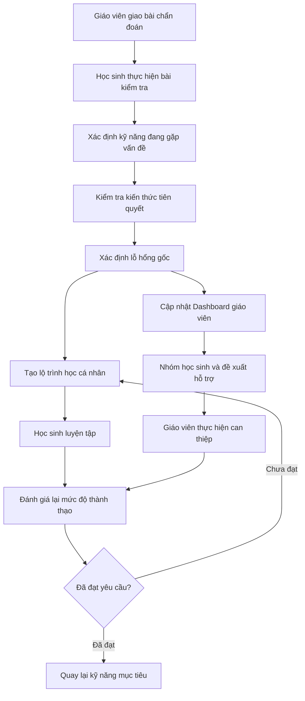

# V-Nexus Tutor — Mô tả dự án

## 1. Project Overview

### Tên dự án

**V-Nexus Tutor**

### Tagline

**“Mỗi học sinh một lộ trình, mỗi giáo viên một trợ lý.”**
**“Close every learning gap, one root cause at a time.”**

### Mô tả ngắn

V-Nexus Tutor là hệ thống hỗ trợ dạy và học thích ứng dành cho lớp học phổ thông Việt
Nam. Hệ thống phân tích bài làm, đối chiếu quan hệ kiến thức tiên quyết để tìm kỹ năng
nền còn thiếu, tạo lộ trình luyện tập phù hợp và cung cấp thông tin có thể hành động cho
giáo viên. Mục tiêu là xử lý nguyên nhân của lỗ hổng thay vì chỉ ghi nhận điểm số hoặc
đúng/sai.

AI đóng vai trò hỗ trợ phân tích, diễn giải và đề xuất. Giáo viên vẫn là người kiểm tra
ngữ cảnh, điều chỉnh khuyến nghị và quyết định hình thức can thiệp cuối cùng.

### Đối tượng sử dụng

- Học sinh tiểu học, chủ yếu lớp 3–4, đặc biệt ở lớp học có chênh lệch nền tảng Tiếng
  Anh lớn và điều kiện mạng không ổn định.
- Giáo viên Tiếng Anh cần theo dõi lớp đông, phát hiện nhu cầu cá nhân/nhóm và ưu tiên
  hỗ trợ.
- Quản trị viên hoặc người quản lý nội dung chịu trách nhiệm chương trình, kỹ năng,
  câu hỏi và kiểm duyệt học liệu.

### Phạm vi MVP chính thức

- Môn Tiếng Anh.
- Tập trung học sinh lớp 3–4, với quan hệ kiến thức tiên quyết xuyên hai khối lớp.
- Mạch minh họa: **Từ vựng theo chủ đề → Mẫu câu cơ bản → Đọc hiểu đoạn ngắn**.
- Knowledge Graph rút gọn nhưng thể hiện được quan hệ kiến thức xuyên khối lớp.
- Bài kiểm tra chẩn đoán và chẩn đoán lỗ hổng nguyên nhân.
- Lộ trình luyện tập cá nhân và dashboard học sinh.
- Dashboard giáo viên, nhóm học sinh, ưu tiên hỗ trợ và phát hiện lỗ hổng chung.
- Hoạt động cốt lõi trong điều kiện offline hoặc băng thông thấp; đồng bộ khi có mạng.
- Nội dung được mapping với yêu cầu cần đạt của Chương trình GDPT 2018.

### Trạng thái triển khai hiện tại

- **Đã có:** khung chạy thử gồm giao diện chat đơn giản, gateway, một Planner Agent,
  Tool Registry, MCP Server mẫu, kết nối PostgreSQL bất đồng bộ và model mẫu
  `chat_log`.
- **Đang dùng trong source:** Domain Adapter cho SME và các tool minh họa; chưa có
  Domain Adapter/tool nghiệp vụ của Adaptive Tutoring.
- **Chưa được chứng minh là đã hoàn thành:** Knowledge Graph, ngân hàng câu hỏi Tiếng Anh,
  luồng chẩn đoán, lộ trình cá nhân, dashboard học sinh/giáo viên và offline sync.
- **Kế hoạch:** triển khai các chức năng nghiệp vụ trong tài liệu này theo thứ tự phụ
  thuộc được mô tả tại `docs/PLAN.md`.

## 2. Problem Statement

### Khoảng cách năng lực trong cùng một lớp học

Trong một lớp tiểu học khoảng 40 học sinh, các em có thể đang học cùng một bài Tiếng Anh
nhưng có nền tảng rất khác nhau. Một học sinh lớp 4 làm sai câu đọc hiểu có thể không
vướng ở nội dung đoạn văn mà do chưa vững từ vựng theo chủ đề hoặc mẫu câu cơ bản từ
lớp 3. Điểm tổng kết hoặc nhãn đúng/sai không chỉ ra được nguyên nhân này.

### Khó khăn của giáo viên khi quản lý lớp đông

Giáo viên khó đồng thời quan sát từng bài làm, truy ngược kiến thức nền, lập kế hoạch
riêng cho từng em và vẫn bảo đảm tiến độ chung của lớp. Tại khu vực khó khăn, hạn chế
về nhân lực, học liệu và đường truyền càng làm việc phân hóa trở nên khó hơn.

### Hạn chế của lộ trình học cố định

Nhiều ứng dụng yêu cầu mọi học sinh đi qua cùng một chuỗi nội dung. Cách này có thể
buộc học sinh đã thành thạo phải học lại, trong khi học sinh đang thiếu kiến thức nền
lại được đưa tiếp tới bài khó hơn. Hệ thống chỉ tối ưu số bài hoàn thành mà chưa chắc
đã xử lý đúng lỗ hổng.

### Hậu quả đối với các nhóm học sinh

- Học sinh đang gặp khó khăn có thể tích lũy thêm lỗ hổng và dần mất khả năng theo kịp
  bài học hiện tại.
- Học sinh mức trung bình có thể luyện tập nhiều nhưng không cải thiện nếu bài tập
  không nhắm đúng kỹ năng nền.
- Học sinh khá/giỏi bị chậm lại nếu phải học lại nội dung đã thành thạo hoặc không được
  tiếp cận nội dung nâng cao phù hợp.

### Vì sao giáo viên phải ở trung tâm

Dữ liệu bài làm chỉ phản ánh một phần bối cảnh học tập. Giáo viên hiểu mục tiêu tiết
học, hoàn cảnh lớp, lịch sử hỗ trợ và các yếu tố ngoài hệ thống. Vì vậy V-Nexus Tutor
phải đưa ra bằng chứng và khuyến nghị có thể giải thích, còn giáo viên có quyền chấp
nhận, điều chỉnh hoặc từ chối.

## 3. Proposed Solution

V-Nexus Tutor tổ chức một vòng lặp hỗ trợ học tập liên tục:

1. Học sinh làm bài chẩn đoán do giáo viên giao hoặc tự bắt đầu trong phạm vi cho phép.
2. Hệ thống xác định kỹ năng hiện tại đang gặp vấn đề (target skill).
3. Hệ thống kiểm tra các kiến thức tiên quyết liên quan, kể cả kiến thức ở khối dưới.
4. Khi có đủ bằng chứng, hệ thống xác định lỗ hổng nguyên nhân (root-cause skill); nếu
   chưa đủ, hệ thống tiếp tục kiểm tra thay vì kết luận chắc chắn.
5. Hệ thống tạo lộ trình học từ kỹ năng nền sâu nhất đến kỹ năng mục tiêu.
6. Học sinh xem nội dung, luyện tập và nhận phản hồi theo dạng lỗi.
7. Hệ thống đánh giá lại, cập nhật mức độ thành thạo và điều chỉnh lộ trình.
8. Giáo viên xem dashboard, nhóm học sinh và đề xuất ưu tiên hỗ trợ.
9. Giáo viên thực hiện can thiệp; kết quả trước/sau được theo dõi để quyết định đóng lỗ
   hổng hay tiếp tục điều chỉnh.

Các hoạt động cần thiết được thiết kế cho điều kiện mạng yếu: nội dung/câu hỏi được tải
trước, bài làm được lưu cục bộ và đồng bộ lại. Một số chức năng nâng cao vẫn có thể cần
Internet nên sản phẩm không được mô tả là “offline hoàn toàn”.

## 4. Main Users

### 4.1. Học sinh

Học sinh lớp 3–4 cần biết mình đang vướng ở kỹ năng Tiếng Anh nào, vì sao cần học lại
một phần kiến thức nền và bước tiếp theo là gì. Các em có thể làm bài chẩn đoán, theo lộ
trình cá nhân, nhận phản hồi phù hợp lứa tuổi, xem tiến độ của chính mình và tiếp tục học
khi mạng yếu. Học sinh không được xem dữ liệu, thứ hạng ưu tiên hay lỗ hổng của học sinh
khác.

### 4.2. Giáo viên

Giáo viên Tiếng Anh cần nhìn được cả lớp và từng học sinh mà không phải tự tổng hợp mọi
bài làm. Giáo viên giao bài, xem bằng chứng chẩn đoán, điều chỉnh nhóm, giao bài bổ sung,
ghi nhận can thiệp, đánh dấu khuyến nghị chưa chính xác và theo dõi kết quả sau hỗ trợ.

### 4.3. Quản trị viên/người quản lý nội dung

Nhóm này quản lý môn học, khối lớp, chủ đề, kỹ năng, yêu cầu cần đạt, quan hệ tiên
quyết, câu hỏi và học liệu. Họ chịu trách nhiệm kiểm duyệt chất lượng trước khi nội dung
được dùng để chẩn đoán hoặc luyện tập.

Dashboard phụ huynh không thuộc MVP và chỉ được xem xét trong Future Scope.

## 5. Core Functional Flows

### 5.1. Quản lý chương trình và Knowledge Graph

**Mục tiêu:** Tạo nền dữ liệu có kiểm duyệt để hệ thống hiểu kỹ năng nào thuộc môn/khối
nào và kỹ năng nào là điều kiện tiên quyết.

**Tác nhân:** Quản trị viên, người quản lý nội dung, chuyên gia môn học.

**Dữ liệu đầu vào:** Môn học, khối lớp, chủ đề, kỹ năng, yêu cầu cần đạt của GDPT 2018,
quan hệ tiên quyết và trạng thái kiểm duyệt.

**Luồng xử lý chính:**

1. Tạo môn Tiếng Anh, các khối 3–4 và các chủ đề trong phạm vi MVP.
2. Tạo kỹ năng với mã nội bộ, tên, mô tả và khối lớp tham chiếu.
3. Mapping kỹ năng với yêu cầu cần đạt tương ứng của GDPT 2018.
4. Thiết lập quan hệ tiên quyết, cho phép kỹ năng lớp 4 phụ thuộc kỹ năng nền lớp 3.
5. Chuyên gia rà soát tính đúng đắn, tính đầy đủ và nguy cơ tạo vòng lặp.
6. Chỉ công bố phiên bản đã được phê duyệt.

**Kết quả đầu ra:** Danh mục kỹ năng và Knowledge Graph có phiên bản, có thể dùng cho
gắn nhãn câu hỏi, chẩn đoán và tạo lộ trình.

**Trường hợp đặc biệt hoặc điều kiện xử lý:** Không gọi mã kỹ năng nội bộ là “mã bài
học chính thức”. Quan hệ tạo chu trình, kỹ năng chưa mapping yêu cầu cần đạt hoặc chưa
kiểm duyệt không được dùng trong chẩn đoán chính thức.

### 5.2. Quản lý ngân hàng câu hỏi

**Mục tiêu:** Bảo đảm mỗi câu hỏi cung cấp bằng chứng phù hợp về một hoặc nhiều kỹ năng.

**Tác nhân:** Người quản lý nội dung, giáo viên, chuyên gia môn học.

**Dữ liệu đầu vào:** Nội dung câu hỏi, loại câu hỏi, đáp án, lời giải, độ khó, kỹ năng
được đo, trọng số liên quan, các phương án sai và dạng lỗi phổ biến.

**Luồng xử lý chính:**

1. Tạo câu hỏi và đáp án/lời giải.
2. Gắn câu hỏi với một hoặc nhiều kỹ năng và chỉ rõ kỹ năng chính nếu cần.
3. Xác định độ khó và mục đích: thăm dò, chẩn đoán, luyện tập hoặc kiểm tra lại.
4. Mapping phương án sai với dạng lỗi phổ biến khi có bằng chứng chuyên môn.
5. Giáo viên hoặc người quản lý nội dung rà soát tính đúng, rõ và phù hợp độ tuổi.
6. Phê duyệt trước khi đưa câu hỏi vào bài làm thực tế.

**Kết quả đầu ra:** Ngân hàng câu hỏi có trạng thái kiểm duyệt và đủ metadata để chọn
câu hỏi, phân tích lỗi và giải thích kết quả.

**Trường hợp đặc biệt hoặc điều kiện xử lý:** Câu hỏi chưa duyệt chỉ dùng để biên tập;
câu hỏi mơ hồ, có nhiều đáp án hợp lệ hoặc mapping kỹ năng chưa chắc chắn phải trả lại
để chỉnh sửa.

### 5.3. Bài kiểm tra chẩn đoán

**Mục tiêu:** Thu thập đủ bằng chứng để xác định kỹ năng đang gặp vấn đề và kiểm tra
các kiến thức tiên quyết liên quan.

**Tác nhân:** Học sinh, giáo viên.

**Dữ liệu đầu vào:** Bài được giao hoặc mục tiêu chẩn đoán, danh sách kỹ năng, câu hỏi
đã duyệt, giới hạn số câu/thời gian và lịch sử kết quả liên quan.

**Luồng xử lý chính:**

1. Giáo viên giao bài hoặc học sinh bắt đầu bài chẩn đoán được phép.
2. Hệ thống chọn câu hỏi theo kỹ năng cần kiểm tra.
3. Với mỗi câu trả lời, lưu kết quả, thời gian trả lời, số lần thử và số lần dùng gợi ý.
4. Nếu học sinh sai, hệ thống chọn câu hỏi thăm dò kỹ năng tiên quyết liên quan.
5. Tiếp tục hỏi cho đến khi đủ bằng chứng hoặc đạt giới hạn câu hỏi/thời gian.
6. Kết thúc và chuyển dữ liệu sang bước chẩn đoán nguyên nhân.

**Kết quả đầu ra:** Một lần làm bài có chuỗi câu hỏi thực tế, câu trả lời và bằng chứng
đủ để phân tích hoặc trạng thái “cần kiểm tra thêm”.

**Trường hợp đặc biệt hoặc điều kiện xử lý:** Mất mạng không làm mất bài; câu bỏ trống,
thoát giữa chừng hoặc dùng gợi ý nhiều phải được ghi nhận. Không suy diễn chắc chắn từ
quá ít câu hỏi.

### 5.4. Chẩn đoán lỗ hổng nguyên nhân

**Mục tiêu:** Phân biệt kỹ năng đang làm sai với kỹ năng nền gây ra lỗi.

**Tác nhân:** Hệ thống hỗ trợ phân tích; giáo viên là người xem xét kết luận.

**Dữ liệu đầu vào:** Bài làm, dạng lỗi, thời gian/gợi ý/lần thử, Knowledge Graph và lịch
sử thành thạo liên quan.

**Luồng xử lý chính:**

1. Xác định **target skill**: kỹ năng biểu hiện lỗi trong bài đang làm.
2. Truy ngược các kỹ năng tiên quyết của target skill.
3. Tổng hợp bằng chứng ủng hộ hoặc phản bác từng kỹ năng nền.
4. Xác định **root-cause skill** sâu nhất có đủ bằng chứng.
5. Xác định khối lớp tham chiếu, mức thành thạo, độ tin cậy và các kỹ năng phía sau bị
   ảnh hưởng.
6. Tạo phần giải thích liên kết trực tiếp tới bằng chứng.

**Kết quả đầu ra:** Target skill, root-cause skill, khối lớp phát sinh lỗ hổng, mức độ
thành thạo, độ tin cậy, bằng chứng và danh sách kỹ năng bị ảnh hưởng.

**Trường hợp đặc biệt hoặc điều kiện xử lý:** Nếu bằng chứng mâu thuẫn hoặc chưa đủ,
kết quả phải là “chưa đủ bằng chứng” kèm đề xuất câu hỏi kiểm tra thêm; không đưa ra kết
luận chắc chắn. Giáo viên có thể đánh dấu kết luận chưa chính xác.

### 5.5. Tạo lộ trình học cá nhân

**Mục tiêu:** Lấp lỗ hổng theo đúng thứ tự phụ thuộc và tránh học lại phần đã thành thạo.

**Tác nhân:** Hệ thống đề xuất; giáo viên có thể điều chỉnh; học sinh thực hiện.

**Dữ liệu đầu vào:** Root-cause skill, target skill, Knowledge Graph, mức thành thạo,
nội dung/câu hỏi đã duyệt và lịch sử học gần nhất.

**Luồng xử lý chính:**

1. Bắt đầu từ lỗ hổng sâu nhất có đủ bằng chứng.
2. Bỏ qua kỹ năng đã đạt yêu cầu và sắp các bước theo quan hệ tiên quyết.
3. Chọn nội dung giải thích, ví dụ và bài tập tăng dần độ khó.
4. Thêm bước kiểm tra lại sau từng kỹ năng.
5. Khi kiến thức nền đạt yêu cầu, đưa học sinh quay lại target skill.
6. Điều chỉnh lộ trình khi có kết quả mới hoặc khi giáo viên can thiệp.

**Kết quả đầu ra:** Chuỗi bước cá nhân có mục tiêu, trạng thái và điều kiện chuyển bước
rõ ràng.

**Trường hợp đặc biệt hoặc điều kiện xử lý:** Nếu thiếu nội dung đã duyệt cho một kỹ
năng, lộ trình phải báo thiếu dữ liệu và không tự chèn nội dung không kiểm chứng. Giáo
viên có thể thay đổi hoặc giao thêm bài.

### 5.6. Học sinh thực hiện lộ trình

**Mục tiêu:** Giúp học sinh hiểu điều cần cải thiện, luyện tập đúng trọng tâm và thấy
tiến độ của chính mình.

**Tác nhân:** Học sinh.

**Dữ liệu đầu vào:** Lộ trình đã tạo, nội dung giải thích/ví dụ, bài tập, phản hồi theo
dạng lỗi và dữ liệu tiến độ.

**Luồng xử lý chính:**

1. Học sinh xem kỹ năng cần cải thiện và lý do ở mức phù hợp lứa tuổi.
2. Xem nội dung giải thích hoặc ví dụ.
3. Làm bài luyện tập từ mức phù hợp.
4. Nhận phản hồi gắn với loại lỗi, không chỉ đáp án đúng.
5. Xem tiến độ và thực hiện bước kiểm tra lại.
6. Theo kết quả, tiếp tục, học lại hoặc chuyển sang kỹ năng tiếp theo.

**Kết quả đầu ra:** Bài làm, tiến độ, trạng thái từng bước và bằng chứng mới để cập nhật
mức thành thạo.

**Trường hợp đặc biệt hoặc điều kiện xử lý:** Nếu học sinh liên tục thất bại, hệ thống
giảm độ khó hoặc báo cần hỗ trợ thay vì lặp vô hạn. Khi offline, dữ liệu phải được giữ
trên thiết bị để đồng bộ sau.

### 5.7. Dashboard giáo viên

**Mục tiêu:** Biến dữ liệu chẩn đoán thành quyết định hỗ trợ cá nhân, theo nhóm hoặc cả
lớp.

**Tác nhân:** Giáo viên được phân công lớp.

**Dữ liệu đầu vào:** Danh sách lớp, bài làm, mức thành thạo, diagnosed gaps, lộ trình,
nhóm, mức ưu tiên và lịch sử can thiệp.

**Luồng xử lý chính:**

1. Hiển thị tổng quan mức thành thạo của lớp theo kỹ năng.
2. Cho phép xem lỗ hổng và bằng chứng của từng học sinh.
3. Hiển thị học sinh cần hỗ trợ trước và lý do.
4. Hiển thị nhóm có cùng nhu cầu và kỹ năng có tỷ lệ chưa đạt cao.
5. Đề xuất hỗ trợ cá nhân, theo nhóm hoặc dạy lại cả lớp.
6. Cho phép giáo viên chấp nhận/từ chối khuyến nghị, điều chỉnh nhóm, giao bài bổ sung,
   ghi nhận can thiệp và đánh dấu kết luận chưa chính xác.
7. Theo dõi kết quả sau can thiệp.

**Kết quả đầu ra:** Dashboard có thể hành động, có drill-down tới bằng chứng và ghi lại
quyết định của giáo viên.

**Trường hợp đặc biệt hoặc điều kiện xử lý:** Giáo viên chỉ được xem lớp được phân
công. Dữ liệu chưa đồng bộ hoặc bằng chứng yếu phải có chỉ báo rõ; không hiển thị xếp
hạng thiếu giải thích.

### 5.8. Tự động nhóm học sinh

**Mục tiêu:** Giúp giáo viên tổ chức hỗ trợ hiệu quả cho học sinh có nhu cầu tương đồng.

**Tác nhân:** Hệ thống đề xuất; giáo viên kiểm tra và điều chỉnh.

**Dữ liệu đầu vào:** Root-cause gaps, target skills, mức thành thạo, kết quả luyện tập
và lớp học hiện tại.

**Luồng xử lý chính:**

1. So sánh lỗ hổng của các học sinh trong cùng lớp.
2. Gom theo kỹ năng cần cải thiện và loại nhu cầu.
3. Phân biệt nhóm cần học lại kiến thức nền, nhóm cần luyện thêm và nhóm cần nội dung
   nâng cao.
4. Hiển thị tiêu chí hình thành nhóm cho giáo viên.
5. Cho phép giáo viên thêm/bớt thành viên.
6. Cập nhật nhóm khi kết quả mới thay đổi nhu cầu.

**Kết quả đầu ra:** Danh sách nhóm có mục tiêu, thành viên, lý do và trạng thái.

**Trường hợp đặc biệt hoặc điều kiện xử lý:** Một học sinh có thể có nhiều nhu cầu
nhưng không nên bị gắn nhãn cố định. Nhóm quá nhỏ/lớn hoặc có bằng chứng yếu phải được
đưa cho giáo viên xem xét.

### 5.9. Xếp mức độ ưu tiên hỗ trợ

**Mục tiêu:** Giúp giáo viên biết trường hợp nào cần can thiệp trước mà không chỉ dựa
trên điểm thấp.

**Tác nhân:** Hệ thống đề xuất; giáo viên quyết định.

**Dữ liệu đầu vào:** Mức nghiêm trọng, số kỹ năng bị ảnh hưởng, mức liên quan với bài
đang học, thời gian mắc kẹt, kết quả nhiều lần luyện tập và lịch sử hỗ trợ.

**Luồng xử lý chính:**

1. Tổng hợp các yếu tố ưu tiên cho từng học sinh/gap.
2. Loại bỏ trường hợp đã đạt yêu cầu hoặc dữ liệu quá cũ.
3. Xếp mức ưu tiên và tạo phần giải thích theo từng yếu tố.
4. Hiển thị cùng trạng thái đã/chưa được giáo viên hỗ trợ.
5. Cập nhật khi có bài làm hoặc can thiệp mới.

**Kết quả đầu ra:** Danh sách ưu tiên kèm lý do có thể kiểm tra, không phải nhãn năng
lực cố định.

**Trường hợp đặc biệt hoặc điều kiện xử lý:** Thiếu dữ liệu phải làm giảm độ chắc chắn;
giáo viên có thể thay đổi thứ tự theo bối cảnh thực tế và quyết định này được ghi nhận.

### 5.10. Phát hiện lỗ hổng chung của lớp

**Mục tiêu:** Xác định khi nào cần hỗ trợ cá nhân, phụ đạo nhóm hoặc dạy lại cả lớp.

**Tác nhân:** Hệ thống tổng hợp; giáo viên quyết định áp dụng.

**Dữ liệu đầu vào:** Kết quả theo kỹ năng, số học sinh có đủ bằng chứng, tỷ lệ chưa đạt
và nội dung lớp đang học.

**Luồng xử lý chính:**

1. Tổng hợp kết quả theo từng kỹ năng trong lớp.
2. Tính tỷ lệ học sinh chưa đạt trên tập dữ liệu hợp lệ.
3. Nếu chỉ ít học sinh gặp vấn đề, đề xuất hỗ trợ cá nhân.
4. Nếu một nhóm đáng kể gặp cùng vấn đề, đề xuất phụ đạo theo nhóm.
5. Nếu phần lớn lớp cùng gặp vấn đề, đề xuất dạy lại cả lớp.
6. Giáo viên xem bằng chứng và quyết định.

**Kết quả đầu ra:** Danh sách kỹ năng phổ biến, phạm vi ảnh hưởng và hình thức hỗ trợ
đề xuất.

**Trường hợp đặc biệt hoặc điều kiện xử lý:** Ngưỡng phải được thống nhất theo bối cảnh,
không cố định tùy tiện. Dữ liệu chưa đồng bộ hoặc quá ít học sinh có bằng chứng không
được dùng để kết luận cho cả lớp.

### 5.11. Ghi nhận can thiệp của giáo viên

**Mục tiêu:** Lưu được hành động sư phạm và đánh giá hiệu quả trước/sau.

**Tác nhân:** Giáo viên.

**Dữ liệu đầu vào:** Học sinh/nhóm, gap mục tiêu, kết quả trước can thiệp, hình thức hỗ
trợ, nội dung dạy lại và bài kiểm tra lại.

**Luồng xử lý chính:**

1. Giáo viên chọn học sinh hoặc nhóm cần hỗ trợ.
2. Chọn hình thức và ghi nội dung đã dạy lại.
3. Giao bài luyện tập hoặc kiểm tra lại.
4. So sánh kết quả trước và sau can thiệp.
5. Đóng gap nếu đạt yêu cầu; nếu chưa đạt, tiếp tục điều chỉnh lộ trình hoặc hình thức
   hỗ trợ.

**Kết quả đầu ra:** Nhật ký can thiệp, kết quả trước/sau và trạng thái gap.

**Trường hợp đặc biệt hoặc điều kiện xử lý:** Không tự quy kết cải thiện chỉ do một can
thiệp khi chưa đủ dữ liệu. Can thiệp chưa có bài kiểm tra lại giữ trạng thái đang theo
dõi.

### 5.12. Offline và đồng bộ

**Mục tiêu:** Không làm gián đoạn bài chẩn đoán/luyện tập khi mạng yếu và không làm mất
dữ liệu học sinh.

**Tác nhân:** Học sinh, giáo viên gián tiếp qua dữ liệu sau đồng bộ.

**Dữ liệu đầu vào:** Gói nội dung/câu hỏi cần thiết, bài được giao, bài làm cục bộ và
trạng thái đồng bộ.

**Luồng xử lý chính:**

1. Khi có mạng, thiết bị tải nội dung và câu hỏi cần thiết.
2. Học sinh làm bài hoặc luyện tập khi mất mạng.
3. Kết quả được lưu cục bộ và hiển thị trạng thái chưa đồng bộ.
4. Khi có mạng, hệ thống tự động thử đồng bộ.
5. Giáo viên xem dữ liệu sau khi đồng bộ thành công.
6. Nếu lỗi, dữ liệu vẫn được giữ lại để thử lại và người dùng được thông báo phù hợp.

**Kết quả đầu ra:** Bài làm không bị mất, trạng thái đồng bộ rõ ràng và dữ liệu hợp
nhất để dashboard sử dụng.

**Trường hợp đặc biệt hoặc điều kiện xử lý:** Tránh tạo trùng khi thử lại. Xung đột dữ
liệu cần được phát hiện và xử lý theo quy tắc đã thống nhất. Không mô tả toàn hệ thống
là offline hoàn toàn nếu kiểm duyệt, phân tích nâng cao hoặc đồng bộ vẫn cần Internet.

## 6. End-to-End User Journey

Vòng lặp kết thúc theo từng gap khi học sinh đạt yêu cầu ở kỹ năng nền và thể hiện lại
được năng lực ở kỹ năng mục tiêu; kết quả mới vẫn tiếp tục được theo dõi.

## 7. Demo Scenario

1. Một học sinh lớp 4 trả lời sai câu đọc hiểu một đoạn văn ngắn về chủ đề quen thuộc.
2. Hệ thống xác định đọc hiểu đoạn ngắn là target skill cần kiểm tra.
3. Hệ thống tiếp tục kiểm tra khả năng nhận biết mẫu câu cơ bản và từ vựng theo chủ đề.
4. Bằng chứng cho thấy học sinh chưa vững từ vựng theo chủ đề đã học ở lớp 3; đây là
   root-cause skill được đề xuất.
5. Hệ thống tạo lộ trình: **từ vựng theo chủ đề → mẫu câu cơ bản → đọc hiểu đoạn ngắn**
   và bỏ qua phần học sinh đã thành thạo.
6. Học sinh xem ví dụ, luyện tập và làm bước kiểm tra lại.
7. Kết quả mới được dùng để cập nhật mức thành thạo và điều chỉnh lộ trình.
8. Giáo viên thấy học sinh trong nhóm cần hỗ trợ về từ vựng theo chủ đề, cùng bằng chứng
   và lý do ưu tiên nếu có.
9. Nếu nhiều học sinh có cùng gap và dữ liệu đủ tin cậy, hệ thống đề xuất phụ đạo theo
   nhóm hoặc dạy lại cả lớp; giáo viên quyết định áp dụng.

Kịch bản demo không tuyên bố tỷ lệ chính xác, mức cải thiện hoặc hiệu quả thực nghiệm
khi chưa có dữ liệu thử nghiệm được kiểm chứng.

## 8. Functional Scope

### 8.1. Bắt buộc cho MVP

- Dữ liệu chương trình Tiếng Anh lớp 3–4 trong mạch demo và mapping yêu cầu cần đạt
  GDPT 2018.
- Knowledge Graph xuyên khối và quan hệ tiên quyết đã kiểm duyệt.
- Ngân hàng câu hỏi đã gắn kỹ năng/độ khó và được phê duyệt.
- Quản lý lớp/học sinh ở mức đủ cho demo.
- Bài kiểm tra chẩn đoán, xác định target skill và root-cause skill.
- Bằng chứng chẩn đoán và trạng thái “cần kiểm tra thêm”.
- Lộ trình cá nhân, học sinh luyện tập, kiểm tra lại và dashboard học sinh.
- Dashboard giáo viên, nhóm học sinh, ưu tiên hỗ trợ và gap chung của lớp.
- Offline cơ bản: tải trước, lưu cục bộ và thử đồng bộ lại.
- Phân quyền để học sinh chỉ xem dữ liệu của mình và giáo viên chỉ xem lớp được giao.

### 8.2. Nên có

- Giáo viên chấp nhận/từ chối khuyến nghị và điều chỉnh nhóm.
- Giao bài bổ sung, ghi nhận can thiệp và so sánh trước/sau.
- Giải thích đầy đủ bằng chứng chẩn đoán.
- Quy trình kiểm duyệt nội dung và phiên bản hóa.
- Đồng bộ đầy đủ, hiển thị lỗi/xung đột rõ ràng.

### 8.3. Mở rộng tương lai

- Dashboard phụ huynh.
- Chatbot hỏi đáp nâng cao.
- Mở rộng Tiếng Anh sang các khối lớp ngoài lớp 3–4.
- Mở rộng sang các môn học khác.
- Placement test bốn kỹ năng ở giai đoạn phù hợp.
- ASR hỗ trợ luyện phát âm và đánh giá kỹ năng nói có kiểm duyệt.
- Sinh câu hỏi bằng AI có quy trình kiểm duyệt.

## 9. AI Roles and Boundaries

- AI hỗ trợ phân tích bài làm, diễn giải bằng chứng, đề xuất lộ trình, nhóm và mức ưu
  tiên; AI không tự thay giáo viên đưa ra quyết định sư phạm cuối cùng.
- Kết luận phải dựa trên dữ liệu bài làm, metadata hợp lệ và quan hệ kiến thức đã kiểm
  duyệt; không suy đoán tự do.
- Khi không đủ dữ liệu, hệ thống yêu cầu kiểm tra thêm và thể hiện mức độ không chắc
  chắn.
- Giáo viên có thể chấp nhận, điều chỉnh, từ chối và phản hồi kết luận.
- Học sinh chỉ xem dữ liệu của chính mình; quyền xem dữ liệu lớp chỉ dành cho người có
  trách nhiệm phù hợp.
- Không so sánh công khai, không gắn nhãn cố định học sinh là “yếu/kém” và không biến
  mức ưu tiên hỗ trợ thành xếp hạng giá trị con người.
- Nội dung hoặc câu hỏi do AI hỗ trợ tạo không được sử dụng trước khi kiểm duyệt.

## 10. Expected Impact

- Phát hiện lỗ hổng cụ thể và nguyên nhân nền thay vì chỉ chấm điểm.
- Giúp học sinh học đúng phần cần thiết và tránh học lại nội dung đã thành thạo.
- Giảm thời gian giáo viên phải tự tổng hợp dữ liệu lớp và truy tìm nguyên nhân lỗi.
- Hỗ trợ can thiệp sớm cho học sinh có nguy cơ bị bỏ lại.
- Cho phép học sinh khá/giỏi tiếp tục với nội dung phù hợp thay vì đi theo lộ trình cố
  định của cả lớp.
- Tăng khả năng tổ chức phụ đạo cá nhân, theo nhóm hoặc dạy lại cả lớp dựa trên bằng
  chứng.
- Hướng tới thu hẹp khoảng cách năng lực trong lớp học, đặc biệt ở nơi nguồn lực và
  đường truyền hạn chế.

Đây là kết quả mong muốn. Hiệu quả thực tế phải được xác nhận bằng pilot và tiêu chí đo
lường trước/sau, không được coi là đã đạt ở trạng thái hiện tại.

## 11. Limitations and Future Scope

### Giới hạn của MVP

- Chỉ minh họa môn Tiếng Anh trong một mạch kỹ năng hẹp của lớp 3–4; chưa đại diện cho
  toàn bộ chương trình Tiếng Anh GDPT 2018.
- Chất lượng chẩn đoán phụ thuộc trực tiếp vào Knowledge Graph, độ phủ câu hỏi, chất
  lượng mapping và số lượng bằng chứng.
- Dữ liệu demo chưa chứng minh độ chính xác, mức cải thiện học tập hay khả năng mở rộng
  tới lớp/trường thật.
- Offline MVP chỉ bảo đảm các hoạt động cốt lõi đã tải trước; kiểm duyệt, quản trị và
  một số phân tích nâng cao vẫn có thể cần Internet.
- Dashboard và khuyến nghị không thay thế đánh giá chuyên môn, quan sát lớp và trao đổi
  trực tiếp của giáo viên.

### Hướng mở rộng

- Mở rộng Knowledge Graph sang các mạch kỹ năng Tiếng Anh khác, các khối lớp khác và
  các môn học khác.
- Bổ sung dashboard phụ huynh với cơ chế ủy quyền và bảo vệ dữ liệu phù hợp.
- Phát triển chatbot nâng cao sau khi các nguồn dữ liệu nghiệp vụ đã đáng tin cậy.
- Xem xét placement test bốn kỹ năng và ASR hỗ trợ phát âm/nói như các phân hệ tương
  lai; không trộn chúng vào MVP Tiếng Anh lớp 3–4.
- Thử nghiệm pilot với lớp thật, xác định tiêu chí thành công, rà soát công bằng và cải
  thiện nội dung dựa trên phản hồi giáo viên/học sinh.
